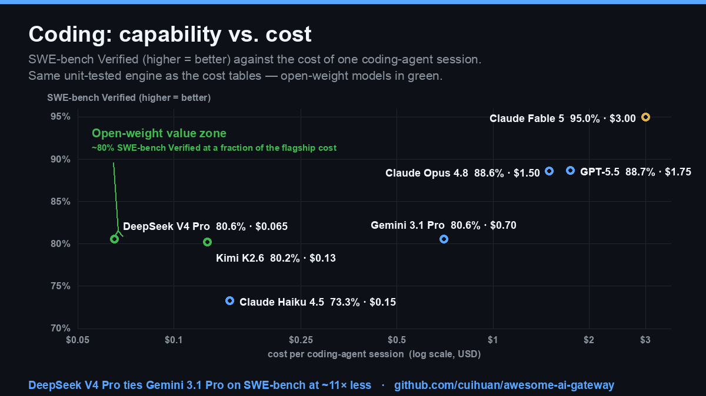

<!-- This file's cost tables are generated by scripts/cost_calc.py from data/models.json. Do not hand-edit between COST markers. -->
# AI Gateway & Model Evaluation Set 📊

> A professional, reproducible evaluation layer for [Awesome AI Gateway](README.md): how the **models** behind the gateways actually perform, what they **really cost** on concrete workloads, and how the **gateways themselves** score on compliance, price, security and stability.
>
> **Languages:** English · [简体中文](BENCHMARKS.zh-CN.md) · Last reviewed: **see footer**

Every number here is **sourced and dated**. Cost cells are *computed* from a public pricing table by a unit-tested script ([`scripts/cost_calc.py`](scripts/cost_calc.py)), never hand-typed — re-run it and you get the same table. Model scores are copied from primary leaderboards with links. Gateway scores follow the published [rubric](#scoring-rubric-apply-consistently) below.

## Contents

- [Part 1 — Authoritative model benchmarks](#part-1--authoritative-model-benchmarks)
- [Part 2 — Pick a model by scenario](#part-2--pick-a-model-by-scenario)
- [Part 3 — Real-world token cost (computed)](#part-3--real-world-token-cost-computed)
- [Part 4 — Gateway scorecard: compliance · price · security · stability](#part-4--gateway-scorecard-compliance--price--security--stability)
- [Methodology & caveats](#methodology--caveats)
- [Sources](#sources)

---

## Part 1 — Authoritative model benchmarks

How capable is each model? These are the most-cited public benchmarks as of the review date. **Read them with the [caveats](#methodology--caveats)** — leaderboards get gamed and contaminated; pair them with the human-preference Arena and the real-world cost tables below.

Ranked by the **Artificial Analysis Intelligence Index** (the most-cited one-number composite). `♦` = GPQA Diamond. `—` = not verified at review time.

| # | Model | Provider | Weights | Context | GPQA♦ | SWE-bench Verified | AIME | Arena Elo | AA Index |
|---|---|---|---|---|---|---|---|---|---|
| 1 | **Claude Fable 5** | Anthropic | Closed | 1M | 95.0% | 95.0% | — | —ᵗ | **65** 🥇 |
| 2 | **Claude Opus 4.8** | Anthropic | Closed | 1M | 93.6% | 88.6% | — | —ᵗ | **61.4** |
| 3 | **GPT-5.5** | OpenAI | Closed | ~400K | 93.6% | 88.7% | — | 1402ᵗ | **60.2** |
| 4 | **Gemini 3.1 Pro** | Google | Closed | 1M | 94.3% | 80.6% | 98.2%¹ | 1406 | **57.2** |
| 5 | **Qwen3.7 Max** | Alibaba | Closed | 1M | 92.4% | — | 75%² | — | **56.6** |
| 6 | **Gemini 3.5 Flash** | Google | Closed | 1M | — | — | — | — | **55.3** |
| 7 | **Kimi K2.6** | Moonshot | 🔓 Open | 256K | 90.5% | 80.2% | 96.4%¹ | — | **53.9** |
| 8 | **Grok 4.3** | xAI | Closed | 1M | ~89%³ | ~75%³ | ~95%³ | — | **53.2** |
| 9 | **Muse Spark** | Meta | 🔓 Open | 262K | — | — | — | — | **52.1** |
| 10 | **DeepSeek V4 Pro** | DeepSeek | 🔓 Open · MIT | 1M | 90.1% | 80.6% | 89.3%² | — | **51.5** |
| 11 | **GLM-5.1** | Z.ai (Zhipu) | 🔓 Open | 200K | 86.2% | — | 95.3%¹ | — | **51.4** |
| 12 | **Claude Haiku 4.5** | Anthropic | Closed | 200K | — | 73.3% | — | — | — |
| 13 | **Mistral Large 3** | Mistral | 🔓 Open | 256K | 43.9% | — | — | — | **22.8** |

ᵗ Arena Elo shown is the prior GPT-5.2 snapshot; models released after May 2026 (Fable 5, Opus 4.8, GPT-5.5) are not yet settled on Arena — capabilities and human-preference ranking diverge, so don't read absence as weakness.
¹ AIME 2026 · ² AIME 2025 (different years and "with tools / no tools" variants are **not directly comparable**) · ³ Grok 4.3 figures extrapolated from Grok 4 reporting — approximate.

> 🛡️ **Contamination-resistant cross-check.** On **SWE-bench Pro** (harder to game than Verified): Fable 5 **80.3%** 🥇 · Opus 4.8 69.2% · GPT-5.5 / Kimi K2.6 ~58.6% · GLM-5.1 58.4%. On **Humanity's Last Exam**: Fable 5 ~59% · Gemini 3.1 Pro 44.4%. The frontier clusters at 90–95% on GPQA — at that ceiling, 1–2 point gaps are noise.

**What each column means**
- **GPQA Diamond** — graduate-level science questions, Google-proof by design.
- **SWE-bench Verified** — fixes real GitHub issues; the headline *agentic coding* score.
- **AIME** — competition math (exact-answer reasoning under pressure).
- **Arena Elo** — blind human preference on [Arena (ex-LMArena)](https://arena.ai/leaderboard); the hardest metric to game.
- **AA Index** — [Artificial Analysis](https://artificialanalysis.ai) Intelligence Index, a composite across agentic/coding/reasoning/knowledge benchmarks.

---

## Part 2 — Pick a model by scenario

Benchmarks rank capability in the abstract; most teams have one concrete job. This maps the common jobs to a *capability* pick and a *value* pick (good-enough, far cheaper). Cross-check the price in [Part 3](#part-3--real-world-token-cost-computed).

| Your job | 🏆 Capability pick | 💸 Value pick (good-enough, far cheaper) | Why |
|---|---|---|---|
| **Agentic coding** (SWE-bench) | Claude Fable 5 / Opus 4.8 | Kimi K2.6 · DeepSeek V4 Pro | Open models hit ~80% SWE-bench Verified at a fraction of flagship cost |
| **Long-context / RAG** (100K+) | Gemini 3.1 Pro (1M ctx) | DeepSeek V4-Flash (1M ctx) | Cost floor on input-heavy work; mind Gemini's >200K surcharge |
| **Hard reasoning / math** | Gemini 3.1 Pro (98.2 AIME'26) | GLM-5.1 · Kimi K2.6 | Open models reach 95%+ AIME — math is the most commoditized frontier skill |
| **Bulk generation** (emails, content) | Claude Haiku 4.5 | DeepSeek V4-Flash · GPT-5.4 nano | Output-heavy → output price dominates; see [3.1](#31-write-a-100k-token-report-generation-heavy) |
| **Cheapest acceptable chat** | GPT-5.4 nano | DeepSeek V4-Flash | ~$0.21 per 1M-token chatbot month vs $17.50 for GPT-5.5 |
| **Open-ended chat** (human pref) | Gemini 3.1 Pro (Arena 1406) · GPT-5.5 | — | Arena Elo is the metric that tracks "feels good to use" |
| **On-prem / data-sovereign** | DeepSeek V4 Pro (MIT) · GLM-5.1 | Kimi K2.6 | Open weights you can run inside your own VPC — zero data egress |
| **Compliance-bound enterprise** | Claude Opus 4.8 / GPT-5.5 via Azure / Bedrock / Vertex | — | Route flagships through a [first-party cloud](#part-4--gateway-scorecard-compliance--price--security--stability) with HIPAA/FedRAMP |

> A **gateway** is what lets you act on this table without rewriting code: set the capability pick as primary and the value pick as fallback, or route per-request by task. That's the whole point of the [list](README.md).

---

## Part 3 — Real-world token cost (computed)

> "Benchmarks tell you what's *best*. Your invoice tells you what's *affordable*." These tables price four concrete workloads across a representative model set, computed from the pricing in [`data/models.json`](data/models.json) by [`scripts/cost_calc.py`](scripts/cost_calc.py). Pricing is USD per 1M tokens; reasoning models bill hidden thinking tokens at the output rate.

### 3.1 Write a 100K-token report (generation-heavy)

<!-- COST:email:START -->
**Write a 100K-token report** (input 2,000 tok · output 100,000 tok)

| # | Model | Provider | Cost |
|---|---|---|---|
| 1 | DeepSeek V4-Flash | DeepSeek | $0.028 |
| 2 | GPT-5.4 nano | OpenAI | $0.13 |
| 3 | Mistral Large 3 | Mistral | $0.15 |
| 4 | Kimi K2.6 | Moonshot | $0.40 |
| 5 | GLM-5.1 | Z.ai (Zhipu) | $0.44 |
| 6 | Claude Haiku 4.5 | Anthropic | $0.50 |
| 7 | Gemini 3.5 Flash | Google | $0.90 |
| 8 | Gemini 3.1 Pro | Google | $1.20 |
| 9 | Grok 4 | xAI | $1.51 |
| 10 | Claude Opus 4.8 | Anthropic | $2.51 |
| 11 | GPT-5.5 | OpenAI | $3.01 |

> 📊 Cheapest is **~106×** less than the most expensive for this task.
<!-- COST:email:END -->

### 3.2 Summarize a 100K-token document (input-heavy)

<!-- COST:summarize:START -->
**Summarize a 100K-token document** (input 100,000 tok · output 2,000 tok)

| # | Model | Provider | Cost |
|---|---|---|---|
| 1 | DeepSeek V4-Flash | DeepSeek | $0.015 |
| 2 | GPT-5.4 nano | OpenAI | $0.023 |
| 3 | Mistral Large 3 | Mistral | $0.053 |
| 4 | Kimi K2.6 | Moonshot | $0.10 |
| 5 | Claude Haiku 4.5 | Anthropic | $0.11 |
| 6 | GLM-5.1 | Z.ai (Zhipu) | $0.15 |
| 7 | Gemini 3.5 Flash | Google | $0.17 |
| 8 | Gemini 3.1 Pro | Google | $0.22 |
| 9 | Grok 4 | xAI | $0.33 |
| 10 | Claude Opus 4.8 | Anthropic | $0.55 |
| 11 | GPT-5.5 | OpenAI | $0.56 |

> 📊 Cheapest is **~38×** less than the most expensive for this task.
<!-- COST:summarize:END -->

### 3.3 Coding-agent session (mixed + reasoning tokens)

  

> **Capability *and* cost on one axis.** Every model with both a published SWE-bench Verified score and a price, plotted on the shared coding-agent session. Open weights (green) hit ~80% — flagship-*tier* coding — for a fraction of the spend: **DeepSeek V4 Pro ties Gemini 3.1 Pro (80.6%) at ~11× less**, and the 95% ceiling (Fable 5) costs ~46× the cheapest model that still clears 80%. The cost axis reuses the unit-tested engine below; capability is the dated `swe_bench_verified` figure. Rendered by [`scripts/make_coding_chart.py`](scripts/make_coding_chart.py) — re-run it and you get the same picture.

<!-- COST:coding:START -->
**Coding-agent session** (input 50,000 tok · output 20,000 tok · +30,000 thinking for reasoning models)

| # | Model | Provider | Cost |
|---|---|---|---|
| 1 | DeepSeek V4-Flash | DeepSeek | $0.021 |
| 2 | Mistral Large 3 | Mistral | $0.055 |
| 3 | GPT-5.4 nano | OpenAI | $0.073 |
| 4 | Kimi K2.6 | Moonshot | $0.13 |
| 5 | Claude Haiku 4.5 | Anthropic | $0.15 |
| 6 | GLM-5.1 | Z.ai (Zhipu) | $0.29 |
| 7 | Gemini 3.5 Flash | Google | $0.53 |
| 8 | Gemini 3.1 Pro | Google | $0.70 |
| 9 | Grok 4 | xAI | $0.90 |
| 10 | Claude Opus 4.8 | Anthropic | $1.50 |
| 11 | GPT-5.5 | OpenAI | $1.75 |

> 📊 Cheapest is **~83×** less than the most expensive for this task.
<!-- COST:coding:END -->

### 3.4 1M-token chatbot month (balanced)

<!-- COST:chatbot:START -->
**1M-token chatbot month** (input 500,000 tok · output 500,000 tok)

| # | Model | Provider | Cost |
|---|---|---|---|
| 1 | DeepSeek V4-Flash | DeepSeek | $0.21 |
| 2 | GPT-5.4 nano | OpenAI | $0.72 |
| 3 | Mistral Large 3 | Mistral | $1.00 |
| 4 | Kimi K2.6 | Moonshot | $2.48 |
| 5 | GLM-5.1 | Z.ai (Zhipu) | $2.90 |
| 6 | Claude Haiku 4.5 | Anthropic | $3.00 |
| 7 | Gemini 3.5 Flash | Google | $5.25 |
| 8 | Gemini 3.1 Pro | Google | $7.00 |
| 9 | Grok 4 | xAI | $9.00 |
| 10 | Claude Opus 4.8 | Anthropic | $15.00 |
| 11 | GPT-5.5 | OpenAI | $17.50 |

> 📊 Cheapest is **~83×** less than the most expensive for this task.
<!-- COST:chatbot:END -->

**Pricing gotchas a gateway buyer must know**
1. **Reasoning tokens are billed as output.** A "cheap" reasoning model can cost more than a flagship once it thinks for 30K tokens. The coding table above includes them.
2. **Cached input is 5–10× cheaper.** Reusing a long system prompt? The cached-input rate, not the headline input rate, is your real cost.
3. **Batch APIs are ~50% off** for non-interactive work (Anthropic, OpenAI, Google all offer this).
4. **China models are priced in RMB** and often have off-peak discounts (DeepSeek) — the USD figures here are conversions and move with the exchange rate.

---

## Part 4 — Gateway scorecard: compliance · price · security · stability

This is the part buyers actually lose sleep over. Models are interchangeable; the gateway is where your keys, prompts, and audit trail live. Each gateway is scored ★1–5 on four axes using the rubric below, so scores are comparable rather than vibes.

### Scoring rubric (apply consistently)

| ★ | Compliance | Security | Stability / reliability |
|---|---|---|---|
| ★5 | SOC 2 Type II **+** ISO 27001 **+** HIPAA BAA **+** EU residency **+** ZDR | Guardrails + PII redaction + RBAC + SSO/SAML + audit logs + key vault | Public uptime SLA ≥99.9%, status page, multi-provider failover, sub-ms overhead |
| ★4 | SOC 2 + one of {ISO, HIPAA, residency} + ZDR option | Most of the above, missing one enterprise control | SLA or strong failover + healthy maintenance |
| ★3 | SOC 2 **or** GDPR posture, ZDR on request | RBAC + audit logs + keys encrypted | Failover/fallback, active releases, no public SLA |
| ★2 | Privacy policy only, no third-party audit | Basic auth + key storage, few controls | Best-effort, community-maintained |
| ★1 | None stated | Known unpatched issues / minimal controls | Sporadic maintenance or unproven |
| 🏠 | *Self-hosted: **you** own these. Score reflects the controls the software gives you to comply.* | | |

**Markup** = what the gateway charges on top of provider token cost. Self-hosted = $0 markup, you pay infra + ops.

#### Hosted multi-provider gateways

| Gateway | Compliance | Markup | Security | Stability | One-line |
|---|---|---|---|---|---|
| **Cloudflare AI Gateway** | ★★★★½ | **0%** | ★★★★ | ★★★★½ | CF holds SOC 2 II / ISO 27001 / PCI; free DLP + fallback; 100% SLA at Business+ |
| **Portkey** (cloud) | ★★★★½ | usage-based | ★★★★½ | ★★★★ | SOC 2 II + ISO + HIPAA; 50+ guardrail marketplace, RBAC/SSO; 99.99% SLA |
| **Vercel AI Gateway** | ★★★★ | **0%** | ★★★½ | ★★★★ | SOC 2 II + 99.99% SLA (Enterprise); true 0% even on BYOK |
| **Helicone** (cloud) | ★★★½ | **0%** passthrough | ★★★½ | ★★★ | SOC 2 + HIPAA (Team); PII detection; OSS core → VPC/self-host option |
| **Requesty** | ★★★½ | ~5% | ★★★½ | ★★★ | EU residency + PII masking + ZDR; SOC 2 "in progress Q2'26" (not yet Type II) |
| **OpenRouter** | ★★★½ | ~5.5% credit fee | ★★★ | ★★★ | 60+ providers, auto-failover, free ZDR; **no public SLA** (enterprise only) |
| **Eden AI** | ★★★½ | ~5.5% platform fee | ★★★ | ★★★½ | France-based, EU-default residency, GDPR-first; SOC 2 UNVERIFIED |
| **Martian** | ★★★ | volume (undisclosed) | ★★★½ | ★★★ | "Airlock" compliance vetting + cost-routing; certs UNVERIFIED |

#### First-party clouds (single-vendor, strongest certs)

| Gateway | Compliance | Markup | Security | Stability | One-line |
|---|---|---|---|---|---|
| **Azure OpenAI** | ★★★★★ | N/A | ★★★★★ | ★★★★½ | SOC 2 / ISO / HIPAA-BAA / **FedRAMP High**, region pinning, ZDR endpoints |
| **AWS Bedrock** | ★★★★★ | N/A | ★★★★★ | ★★★★½ | ISO / SOC / CSA STAR / HIPAA / FedRAMP High; multi-model within Bedrock |
| **Google Vertex AI** | ★★★★½ | N/A | ★★★★★ | ★★★★½ | First GenAI platform to FedRAMP High (2025); SOC 2 / ISO / HIPAA |
| **OpenAI** (direct) | ★★★★ | N/A | ★★★★ | ★★★★ | SOC 2 II, HIPAA-BAA, ZDR; but single-vendor = no cross-provider failover |

> ⚠️ First-party clouds win compliance but **can't survive a provider outage** — that cross-vendor failover is exactly what a gateway in front of them buys you.

#### Open-source self-hosted (🏠 you own compliance; $0 markup, you pay infra)

| Gateway | Compliance | Security | Stability | One-line |
|---|---|---|---|---|
| **Portkey Gateway** (OSS) | ★★★🏠 | ★★★★ | ★★★★ | Apache-2.0; full guardrails, MCP OAuth, fallbacks free; <1ms overhead |
| **Kong AI Gateway** | ★★★½ | ★★★★½ | ★★★★ | PII sanitization (20+ types), Prompt Guard, RBAC on mature Kong lineage |
| **Envoy AI Gateway** | ★★★🏠 | ★★★★ | ★★★★ | Multi-provider + MCP gateway w/ OAuth+CEL authz; native K8s/Istio |
| **Bifrost** (Maxim) | ★★★🏠 | ★★★½ | ★★★★½ | Go; ~11µs overhead benchmark, cluster mode; no known CVEs |
| **TensorZero** | ★★★🏠 | ★★★ | ★★★★ | Rust; <1ms p99 at 10k+ QPS; routing + built-in observability |
| **Higress** | ★★★🏠 | ★★★½ | ★★★★ | Istio/Envoy AI-native, Wasm plugins, console; Alibaba-backed |
| **Apache APISIX** | ★★★🏠 | ★★★ | ★★★★ | ai-proxy / ai-prompt-guard plugins on mature ASF gateway |
| **LiteLLM** | ★★★🏠 | ★★½ ⚠️ | ★★★★ | SOC 2 I + ISO (Enterprise); **patch to ≥v1.83.7** — 2 serious 2026 CVEs (1 RCE on CISA KEV), both fixed |
| **GPT-Load** | ★★🏠 | ★★½ | ★★★½ | Go key-pool rotation + encrypted key store + dual auth; proxy-level only |
| **new-api** | ★★🏠 | ★½ ⚠️ | ★★★ | ~38k★ & active, but **cluster of 2026 CVEs** (IDOR/SSRF/SQLi) — sandbox + patch fast |
| **one-api** | ★★🏠 | ★★ | ★★½ | The MIT original; maintenance slowed — new-api is the more active successor |

> ⚠️ **CVE honesty.** Popularity makes OSS gateways targets. LiteLLM (pre-auth SQLi + unauth RCE) and new-api (IDOR/SSRF/SQLi) both had serious 2026 advisories — *patched*, but the lesson is: pin to current stable, restrict egress, and don't expose the admin panel publicly. Absence of found CVEs (Bifrost, TensorZero, Higress, Envoy, GPT-Load) ≠ proven-secure; it can mean less scrutiny.

> 🏠 **Self-hosted shifts the burden to you.** LiteLLM/Bifrost/Kong score on the *controls they hand you* (RBAC, audit logs, key vaulting, on-prem) — but SOC 2 / HIPAA compliance of the *deployment* is yours to earn. That's the trade for $0 markup and full data control.

---

## Methodology & caveats

- **Benchmarks are necessary, not sufficient.** Public sets leak into training data (contamination), and vendors optimize for the leaderboard. We therefore show *several* benchmarks + blind human preference (Arena) + real cost, and weight none of them alone.
- **"Verified" matters.** We prefer SWE-bench **Verified** over the raw set, and official model cards / [Artificial Analysis](https://artificialanalysis.ai) independent runs over vendor press releases. Vendor-reported numbers are labeled.
- **Cost ≠ price.** Headline $/token hides reasoning-token inflation, cached-input discounts and batch pricing. Part 3 prices *workloads*, not tokens, and the script is open for you to plug your own token mix.
- **Gateway scores are point-in-time estimates** from public trust pages, status pages and docs. Compliance certs lapse and ship; verify before you sign. Corrections welcome via PR — see [CONTRIBUTING](CONTRIBUTING.md).
- **No affiliation.** This list takes no money from any vendor listed. Self-hosted and commercial options are scored on the same axes.

## Sources

Primary leaderboards and pricing references (verify live — these move weekly):
- [LMArena](https://lmarena.ai) — blind human-preference Elo
- [Artificial Analysis](https://artificialanalysis.ai) — Intelligence Index, price & speed
- [SWE-bench](https://www.swebench.com) — agentic coding leaderboard
- [Vellum LLM Leaderboard](https://www.vellum.ai/llm-leaderboard), [OpenRouter rankings](https://openrouter.ai/rankings)
- Official pricing: [Anthropic](https://www.anthropic.com/pricing), [OpenAI](https://openai.com/api/pricing/), [Google](https://ai.google.dev/pricing), [DeepSeek](https://api-docs.deepseek.com/quick_start/pricing)

Per-cell sources are listed in [`data/models.json`](data/models.json) and the gateway research notes.

---

*Maintained as part of [Awesome AI Gateway](README.md). Model scores and prices change fast; this set is reviewed on a published cadence and every figure is dated at its source.*

**Last reviewed: 2026-06-12** · benchmark & pricing snapshot in [`data/models.json`](data/models.json), gateway scores in [`data/gateways_eval.json`](data/gateways_eval.json).
