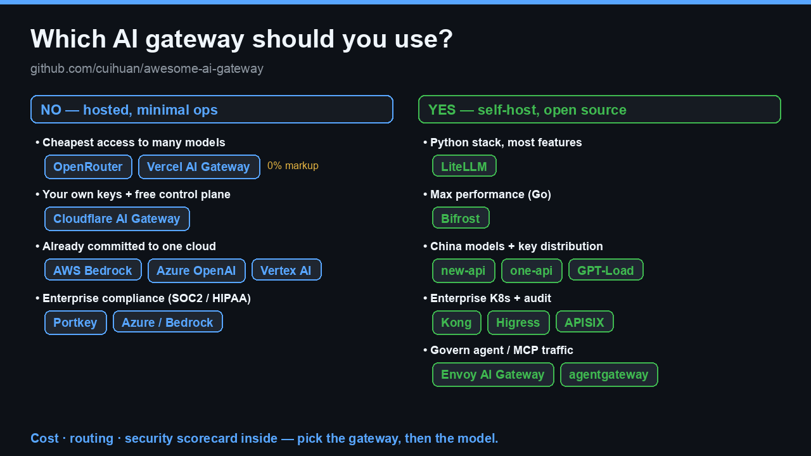
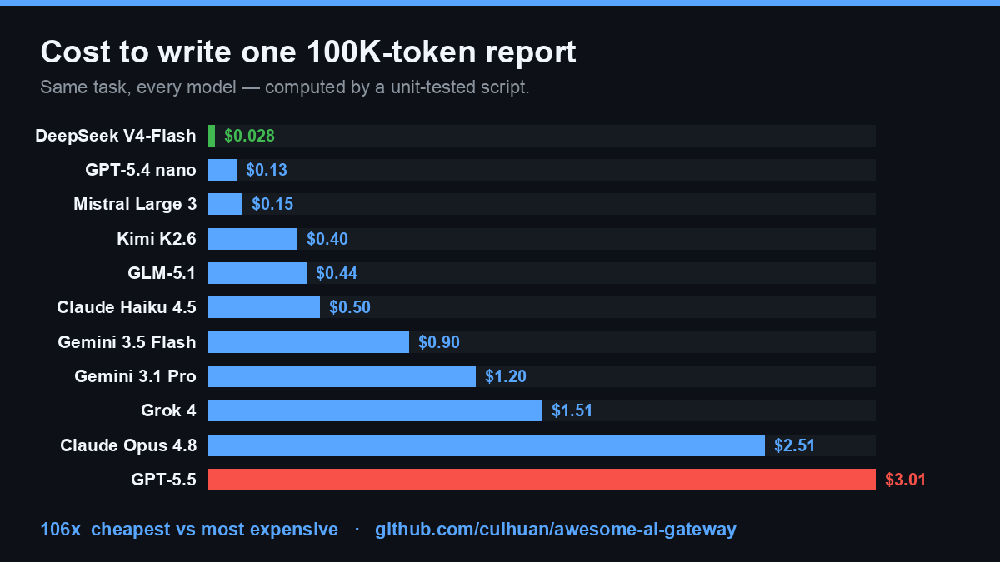

# Awesome AI Gateway [](https://awesome.re)

[](https://github.com/cuihuan/awesome-ai-gateway/stargazers)
[](BENCHMARKS.md)
[](.github/workflows/daily-update.yml)

> **Pick the right AI gateway for your need in ~10 seconds — then trust the answer.** A decision tree, a drop-in snippet, a reproducible cost benchmark, and independent evidence for what we exclude. Organized by what you actually need, not by vendor.

**Languages:** English · [简体中文](README.zh-CN.md)

<p align="center">
<a href="#which-gateway-should-i-use"><kbd> &nbsp; 🧭 Pick a gateway &nbsp; </kbd></a> &nbsp;
<a href="https://cuihuan.github.io/awesome-ai-gateway/"><kbd> &nbsp; 🚀 Live interactive site &nbsp; </kbd></a> &nbsp;
<a href="BENCHMARKS.md"><kbd> &nbsp; 📊 Cost & scorecard &nbsp; </kbd></a> &nbsp;
<a href="#quick-start-drop-in"><kbd> &nbsp; ⚡ Drop-in snippet &nbsp; </kbd></a>
</p>

<details>
<summary>📑 <b>Full contents</b> — pick fast · browse by need · reference</summary>

[](CONTRIBUTING.md)
[](LICENSE)
[](https://github.com/cuihuan/awesome-ai-gateway/commits/main)

**Pick fast** · [Which gateway should I use?](#which-gateway-should-i-use) · [Quick start (drop-in)](#quick-start-drop-in) · [Quick comparison](#quick-comparison)

**Browse by need** · [💰 Cost-first](#-cost-first-cheapest-multi-model-access) · [🔓 Self-hosted](#-self-hosted-open-source) · [🏢 Enterprise & compliance](#-enterprise--compliance) · [☁️ First-party clouds](#️-first-party-gateways-cloud--model-vendors) · [🇨🇳 China ecosystem](#-china-ecosystem) · [🤖 MCP & agent gateways](#-mcp--agent-gateways)

**Reference** · [📊 Evaluation set](BENCHMARKS.md) · [How to choose safely](#how-to-choose-safely) · [FAQ](#faq) · [📚 Essential reading](#-essential-reading) · [📰 What's new](#-whats-new) · [Glossary](#glossary) · [Contributing](#contributing)

</details>

## Which gateway should I use?

<p align="center">
  
</p>

**⚡ Fast answer** — one sane default per need (alternatives in each linked section):

| I need… | Start with | Drill into |
|---|---|---|
| Cheapest access to many models, zero ops | **OpenRouter** | [Cost-first](#-cost-first-cheapest-multi-model-access) |
| Zero markup on my own keys | **Vercel** / **Cloudflare** | [Cost-first](#-cost-first-cheapest-multi-model-access) |
| Self-host, broadest features | **LiteLLM** | [Self-hosted](#-self-hosted-open-source) |
| Self-host, lowest overhead | **Bifrost** (Go) | [Self-hosted](#-self-hosted-open-source) |
| China models + team key billing | **new-api** | [China ecosystem](#-china-ecosystem) |
| Enterprise K8s + audit | **Kong** / **Higress** | [Enterprise](#-enterprise--compliance) |
| Strongest compliance (HIPAA/FedRAMP) | **Azure** / **Bedrock** | [First-party](#️-first-party-gateways-cloud--model-vendors) |
| Govern agents / MCP traffic | **agentgateway** | [MCP & agents](#-mcp--agent-gateways) |

<details>
<summary>📋 The full decision tree — every branch, copy-pasteable</summary>

```text
Do you want to self-host?
│
├─ NO — hosted, minimal ops
│   ├─ Cheapest access to many models ──────────▶ OpenRouter · Vercel AI Gateway (0% markup)
│   ├─ Free control plane over your own keys ───▶ Cloudflare AI Gateway
│   ├─ EU data residency matters ───────────────▶ Requesty · Eden AI · nexos.ai
│   └─ Already on one cloud ────────────────────▶ AWS Bedrock · Azure APIM · Vertex AI
│
└─ YES — self-hosted / open source
    ├─ Python stack, broadest features ─────────▶ LiteLLM
    ├─ Raw performance (Go/Rust/TS) ────────────▶ Bifrost · Portkey Gateway
    ├─ Built-in evals + observability ──────────▶ Helicone · Portkey Gateway
    ├─ Key distribution / billing / CN models ──▶ new-api · one-api · GPT-Load
    ├─ Enterprise K8s, audit, guardrails ───────▶ Kong · Higress · APISIX · Envoy AI Gateway
    └─ Governing AI agents & MCP traffic ───────▶ agentgateway · Lunar.dev
```

</details>

### ✅ Why trust this list
- **Independent — no vendor money, no affiliate links, CC0.** Unlike affiliate-driven relay "rankings," nobody pays to appear here.
- **Reproducible, not asserted.** Every cost cell is computed from [open pricing data](data/models.json) by a [unit-tested script](scripts/cost_calc.py); stars refresh daily via CI.
- **Honest about risk.** We disclose CVEs, label archived/stale projects, and [exclude gray-market relays](#how-to-choose-safely) — with the research to back it.

---

> **Why this matters:** the same task can cost **100× more** depending on the model behind your gateway. An **AI gateway** sits between your code and LLM providers — one endpoint, one key, many models — handling routing, failover, caching, rate limits, cost tracking and guardrails, so you change a `base_url` instead of rewriting your app. Pick the gateway here, then the [evaluation set](BENCHMARKS.md) shows which model to route to.

<p align="center">
  <a href="BENCHMARKS.md"></a>
</p>

⭐ **Found this useful? [Star it](https://github.com/cuihuan/awesome-ai-gateway)** — that's how the next engineer choosing a gateway finds it. CC0, no signup, no tracking, no vendor money.

## Quick start (drop-in)

The whole promise of a gateway: **change `base_url`, keep your OpenAI code.** Same request, now with routing, fallback, caching and cost tracking.

```python
from openai import OpenAI

# Hosted example — OpenRouter (400+ models, one key):
client = OpenAI(
    base_url="https://openrouter.ai/api/v1",
    api_key="sk-or-...",
)

# Self-hosted example — a LiteLLM proxy you run:
client = OpenAI(
    base_url="http://localhost:4000",
    api_key="sk-litellm-...",
)

resp = client.chat.completions.create(
    model="anthropic/claude-fable-5",        # ask the gateway for any provider's model
    messages=[{"role": "user", "content": "Hello!"}],
)
```

**OpenAI-compatible `base_url` cheat sheet** (verified June 2026 — swap in, keep your code):

| Gateway | `base_url` |
|---|---|
| OpenRouter | `https://openrouter.ai/api/v1` |
| Vercel AI Gateway | `https://ai-gateway.vercel.sh/v1` |
| Cloudflare AI Gateway | `https://gateway.ai.cloudflare.com/v1/{account}/{gateway}/compat` |
| Portkey | `https://api.portkey.ai/v1` |
| Helicone AI Gateway | `https://ai-gateway.helicone.ai/ai` |
| Requesty | `https://router.requesty.ai/v1` |
| LiteLLM (self-hosted) | `http://localhost:4000` |

## Quick comparison

Stars auto-refresh daily. ✅ built-in · ➕ via plugin/paid tier · ❌ not available.

| Project | Type | Stars | License | Multi-provider | Fallback / LB | Caching | Guardrails | Cost tracking |
|---|---|---|---|---|---|---|---|---|
| [LiteLLM](https://github.com/BerriAI/litellm) | OSS proxy + SDK | <!--s:BerriAI/litellm-->⭐ 50.4k<!--/s--> | MIT¹ | ✅ 100+ | ✅ | ✅ | ✅ | ✅ |
| [new-api](https://github.com/QuantumNous/new-api) | OSS relay/billing | <!--s:QuantumNous/new-api-->⭐ 38.8k<!--/s--> | AGPL-3.0 | ✅ | ✅ | ➕ | ➕ | ✅ |
| [one-api](https://github.com/songquanpeng/one-api) | OSS relay/billing | <!--s:songquanpeng/one-api-->⭐ 34.9k<!--/s--> | MIT | ✅ | ✅ | ❌ | ❌ | ✅ |
| [Kong AI Gateway](https://github.com/Kong/kong) | OSS API gateway | <!--s:Kong/kong-->⭐ 43.6k<!--/s--> | Apache-2.0 | ✅ | ✅ | ✅ semantic | ✅ | ✅ |
| [Apache APISIX](https://github.com/apache/apisix) | OSS API gateway | <!--s:apache/apisix-->⭐ 16.7k<!--/s--> | Apache-2.0 | ✅ | ✅ | ➕ | ➕ | ➕ |
| [Portkey Gateway](https://github.com/Portkey-AI/gateway) | OSS gateway + SaaS | <!--s:Portkey-AI/gateway-->⭐ 12.1k<!--/s--> | MIT | ✅ 1600+ | ✅ | ✅ | ✅ 50+ | ➕ SaaS |
| [TensorZero](https://github.com/tensorzero/tensorzero) | OSS LLMOps · ⚠️ archived '26 | <!--s:tensorzero/tensorzero-->⭐ 11.6k<!--/s--> | Apache-2.0 | ✅ | ✅ | ✅ | ➕ | ✅ |
| [Higress](https://github.com/higress-group/higress) | OSS AI-native gateway | <!--s:higress-group/higress-->⭐ 8.7k<!--/s--> | Apache-2.0 | ✅ | ✅ | ✅ | ✅ | ✅ |
| [GPT-Load](https://github.com/tbphp/gpt-load) | OSS key-pool proxy | <!--s:tbphp/gpt-load-->⭐ 6.2k<!--/s--> | MIT | ✅ | ✅ key rotation | ❌ | ❌ | ➕ |
| [Bifrost](https://github.com/maximhq/bifrost) | OSS gateway (Go) | <!--s:maximhq/bifrost-->⭐ 5.8k<!--/s--> | Apache-2.0 | ✅ | ✅ adaptive | ✅ | ✅ | ✅ |
| [Helicone](https://github.com/Helicone/helicone) | OSS observability + gateway | <!--s:Helicone/helicone-->⭐ 5.8k<!--/s--> | Apache-2.0 | ✅ | ✅ | ✅ | ➕ | ✅ |
| [Envoy AI Gateway](https://github.com/envoyproxy/ai-gateway) | OSS K8s gateway | <!--s:envoyproxy/ai-gateway-->⭐ 1.7k<!--/s--> | Apache-2.0 | ✅ | ✅ | ➕ | ➕ | ✅ |
| [OpenRouter](https://openrouter.ai) | SaaS marketplace | — | Commercial | ✅ 400+ | ✅ | ✅ | ➕ | ✅ |
| [Vercel AI Gateway](https://vercel.com/ai-gateway) | SaaS (0% markup) | — | Commercial | ✅ 100s | ✅ | ❌ | ❌ | ✅ |
| [Cloudflare AI Gateway](https://developers.cloudflare.com/ai-gateway/) | SaaS control plane | — | Commercial (free tier) | ✅ | ✅ dynamic | ✅ | ✅ | ✅ budgets |

¹ LiteLLM core is MIT; the repo contains a separately licensed enterprise directory.

> 📂 **Browse the raw data** (machine-readable, CC0): [models & pricing JSON](data/models.json) · [cost table CSV](data/cost_table.csv) · [gateway scorecard CSV](data/gateways_scorecard.csv). Every cost cell is regenerated from this data by a [unit-tested script](scripts/cost_calc.py).

<p align="center">
  
</p>

> _The full directory at a glance — browse the sections below by your need._

## 💰 Cost-first: cheapest multi-model access

*Pain point: "I want many models for the least money and zero ops."*

- [OpenRouter](https://openrouter.ai) — The dominant model marketplace: 400+ models behind one OpenAI-compatible API, pay-as-you-go with automatic failover; ~5.5% fee when buying credits. $113M Series B (May 2026), ~8M users.
- [Vercel AI Gateway](https://vercel.com/ai-gateway) — Hundreds of models at **provider list price (0% markup)**, $5/month free credits, zero-data-retention option; pairs naturally with the AI SDK.
- [Cloudflare AI Gateway](https://developers.cloudflare.com/ai-gateway/) — Free control plane in front of your own provider keys: caching, dynamic routing, unified billing, and dollar-denominated spend limits (2026 beta).
- [Requesty](https://requesty.ai) — EU-friendly OpenRouter alternative: 400+ models, sub-20ms failover, ~5% markup.
- [Eden AI](https://www.edenai.co) — Unified API for 500+ models plus vision/OCR/speech; EU-based, ~5.5% platform fee.
- [Helicone AI Gateway (cloud)](https://www.helicone.ai) — Passthrough billing at **0% markup** with observability bundled.
- [GPT-Load](https://github.com/tbphp/gpt-load) <!--s:tbphp/gpt-load-->⭐ 6.2k<!--/s--> — High-performance Go proxy that rotates pools of API keys across channels to maximize quota usage.
- [Loop Gateway](https://github.com/Loop-XXI/loop-gateway) — OpenAI-compatible proxy that meters every request in Bitcoin sats instead of dollars. 311 models via OpenRouter at a 15% markup. No accounts, no email, no card; top up over Lightning, get a bearer token. Three auth rails (prepaid bearer, L402, Cashu). Self-hostable in Go via docker-compose, live at [api.loopxxi.com](https://api.loopxxi.com).
- [AIMLAPI](https://aimlapi.com) — One OpenAI/Anthropic-compatible endpoint fronting 400+ models (chat, image, video, audio, embeddings); prepaid, OpenRouter-style aggregator.
- [Novita AI](https://novita.ai) — Unified API to 200+ open-source models (DeepSeek/Qwen/Llama…) with load balancing, autoscaling and failover; also a GPU cloud.
- [Glama Gateway](https://glama.ai/ai/gateway) — OpenAI-compatible gateway to 100+ models with consolidated billing, caching and logging (OSS core [glama-ai/lightport](https://github.com/glama-ai/lightport)).

> 💡 Squeeze more from any gateway: enable **semantic caching** (Kong, Bifrost, Zuplo), set **spend limits** (Cloudflare, Zuplo, Pydantic/Logfire), and route easy prompts to cheap models (see [Smart routing](#-smart-routing--model-selection)).

## 🔓 Self-hosted open source

*Pain point: "My keys, my infra, no per-token middleman fee."*

- [LiteLLM](https://github.com/BerriAI/litellm) <!--s:BerriAI/litellm-->⭐ 50.4k<!--/s--> — The default choice: Python SDK + proxy server speaking OpenAI format to 100+ providers, with virtual keys, budgets, load balancing and guardrails.
- [Portkey Gateway](https://github.com/Portkey-AI/gateway) <!--s:Portkey-AI/gateway-->⭐ 12.1k<!--/s--> — Fast TypeScript gateway (1,600+ models, 50+ guardrails) that also powers Portkey's commercial LLMOps platform.
- [TensorZero](https://github.com/tensorzero/tensorzero) <!--s:tensorzero/tensorzero-->⭐ 11.6k<!--/s--> — ⚠️ **Archived June 2026** (company wound down; repo read-only, Apache-2.0 code + community forks remain). Rust gateway unified with observability, evals, experimentation and optimization.
- [Bifrost](https://github.com/maximhq/bifrost) <!--s:maximhq/bifrost-->⭐ 5.8k<!--/s--> — Go gateway from Maxim AI claiming ~50x LiteLLM throughput; adaptive load balancing, cluster mode, MCP support.
- [Helicone](https://github.com/Helicone/helicone) <!--s:Helicone/helicone-->⭐ 5.8k<!--/s--> — Observability-first platform (YC W23) with a Rust [ai-gateway](https://github.com/Helicone/ai-gateway) <!--s:Helicone/ai-gateway-->⭐ 601<!--/s-->.
- [Plano](https://github.com/katanemo/plano) <!--s:katanemo/plano-->⭐ 6.6k<!--/s--> — AI-native proxy and data plane for agents (formerly Arch Gateway / archgw).
- [LLM Gateway](https://github.com/theopenco/llmgateway) <!--s:theopenco/llmgateway-->⭐ 1.3k<!--/s--> — Open-source OpenRouter alternative: route, manage and analyze requests across providers.
- [APIPark](https://github.com/APIParkLab/APIPark) <!--s:APIParkLab/APIPark-->⭐ 1.8k<!--/s--> — Cloud-native LLM API management and distribution platform.
- [Pydantic AI Gateway](https://github.com/pydantic/pydantic-ai-gateway) <!--s:pydantic/pydantic-ai-gateway-->⭐ 189<!--/s--> — BYOK gateway with cost caps and OTel; ⚠️ repo archived, now folded into Pydantic Logfire.
- [OptiLLM](https://github.com/algorithmicsuperintelligence/optillm) <!--s:algorithmicsuperintelligence/optillm-->⭐ 4.1k<!--/s--> — Optimizing inference proxy that boosts accuracy via test-time compute techniques.
- [aisuite](https://github.com/andrewyng/aisuite) <!--s:andrewyng/aisuite-->⭐ 14.4k<!--/s--> — Andrew Ng's unified multi-provider client. A library rather than a deployable proxy — fits when you don't want network hops.
- [Shepherd Model Gateway (SMG)](https://github.com/lightseekorg/smg) <!--s:lightseekorg/smg-->⭐ 333<!--/s--> — Engine-agnostic gateway in Rust: one OpenAI/Anthropic-compatible endpoint over vLLM/SGLang/TRT-LLM + cloud providers, with KV-cache-aware routing and WASM plugins.
- [RelayPlane](https://github.com/RelayPlane/proxy) <!--s:RelayPlane/proxy-->⭐ 180<!--/s--> — MIT, local-first proxy (npm): 11 providers behind one endpoint with per-request cost attribution and hard daily/hourly budget caps.
- ⚠️ Stale but historically notable: [BricksLLM](https://github.com/bricks-cloud/BricksLLM) <!--s:bricks-cloud/BricksLLM-->⭐ 1.2k<!--/s--> (PII masking, per-key limits; inactive since early 2025), [Glide](https://github.com/EinStack/glide) <!--s:EinStack/glide-->⭐ 160<!--/s--> (inactive since 2024).

## 🏢 Enterprise & compliance

*Pain point: "Audit logs, PII redaction, RBAC, on-prem, and the EU AI Act (enforceable Aug 2026)."*

- [Kong AI Gateway](https://github.com/Kong/kong) <!--s:Kong/kong-->⭐ 43.6k<!--/s--> — Mature API gateway with AI plugins: semantic caching/routing, prompt guard, token rate-limiting; Konnect for managed control plane.
- [Apache APISIX](https://github.com/apache/apisix) <!--s:apache/apisix-->⭐ 16.7k<!--/s--> — Cloud-native API + AI gateway with `ai-proxy` / `ai-proxy-multi` plugins.
- [Envoy AI Gateway](https://github.com/envoyproxy/ai-gateway) <!--s:envoyproxy/ai-gateway-->⭐ 1.7k<!--/s--> — CNCF-aligned GenAI access on Envoy Gateway, backed by Tetrate and Bloomberg.
- [kgateway](https://github.com/kgateway-dev/kgateway) <!--s:kgateway-dev/kgateway-->⭐ 5.6k<!--/s--> — CNCF API/AI gateway, the base of Solo.io's commercial [Gloo AI Gateway](https://www.solo.io).
- [TrueFoundry AI Gateway](https://www.truefoundry.com) — Enterprise gateway with routing, guardrails and RBAC, deployable into your K8s/VPC.
- [nexos.ai](https://nexos.ai) — Enterprise AI gateway/orchestration from the Nord Security founders (€30M Series A, Oct 2025).
- [Tyk AI Studio](https://tyk.io) — AI governance suite: budgets, model catalogs, guardrails on Tyk's gateway.
- [Gravitee Agent Mesh](https://www.gravitee.io) — LLM Proxy, MCP Proxy and A2A support inside Gravitee APIM.
- [WSO2 AI Gateway](https://wso2.com/api-manager/usecases/ai-gateway/) — Egress management for LLM traffic: model routing, semantic caching, guardrails.
- [F5 AI Gateway](https://www.f5.com) — Containerized AI traffic gateway; data-leakage detection via the LeakSignal acquisition (Nov 2025).
- [IBM API Connect AI Gateway](https://www.ibm.com) — Policy enforcement, masking and audit for LLM traffic.
- [MuleSoft AI / Omni Gateway](https://www.mulesoft.com/platform/ai-gateway) — Governs LLM, MCP and agent traffic alongside classic APIs.
- [Lunar.dev](https://github.com/TheLunarCompany/lunar) <!--s:TheLunarCompany/lunar-->⭐ 455<!--/s--> — Egress consumption gateway repositioned around MCP/agent governance.
- [KrakenD AI Gateway](https://www.krakend.io/docs/ai-gateway/) — High-performance, stateless Go API gateway ([krakend/krakend-ce](https://github.com/krakend/krakend-ce) <!--s:krakend/krakend-ce-->⭐ 2.6k<!--/s-->) with an AI proxy + prompt-security layer.
- [Broadcom Layer7 AI Gateway](https://www.broadcom.com/products/software/api-management) — LLM traffic governance, threat protection and quotas on the mature Layer7 API platform.
- [Cequence AI Gateway](https://www.cequence.ai) — API-security-first AI gateway: discovery, guardrails and threat protection for LLM/agent traffic.

## ☁️ First-party gateways (cloud & model vendors)

*Pain point: "We're already committed to one cloud — give us the native path."*

- [AWS Bedrock](https://aws.amazon.com/bedrock/) — Multi-model access via the unified Converse API, cross-region inference, and AgentCore Gateway for tools/MCP.
- [Azure API Management — GenAI gateway](https://learn.microsoft.com/azure/api-management/genai-gateway-capabilities) — Token limits, semantic caching and load balancing in front of Azure OpenAI / AI Foundry.
- [Google Apigee + Vertex AI](https://cloud.google.com/apigee) — LLM gateway patterns on Apigee with Vertex Model Garden as the managed hub.
- [Cloudflare AI Gateway](https://developers.cloudflare.com/ai-gateway/) — See [Cost-first](#-cost-first-cheapest-multi-model-access); the strongest free first-party option.
- [Vercel AI Gateway](https://vercel.com/ai-gateway) — GA, 0% markup, ZDR option; the default for Next.js/AI SDK shops.
- [Databricks Unity AI Gateway](https://www.databricks.com) — Mosaic AI Gateway folded into Unity Catalog, adding agent + MCP governance.

## 🇨🇳 China ecosystem

*Pain point: "Domestic models (Qwen/DeepSeek/GLM/Kimi), CNY payment, key distribution & billing for teams."*

- [new-api](https://github.com/QuantumNous/new-api) <!--s:QuantumNous/new-api-->⭐ 38.8k<!--/s--> — The most active one-api fork, now a "unified AI model hub": protocol conversion, billing, Rerank/Realtime endpoints. AGPL-3.0.
- [one-api](https://github.com/songquanpeng/one-api) <!--s:songquanpeng/one-api-->⭐ 34.9k<!--/s--> — The original LLM API 管理&分发系统 (OpenAI/Azure/Claude/Gemini/DeepSeek/豆包…); development has slowed.
- [Higress](https://github.com/higress-group/higress) <!--s:higress-group/higress-->⭐ 8.7k<!--/s--> — Alibaba's AI-native gateway on Envoy/Istio, first-class 通义/DeepSeek support; hosted version at higress.ai.
- [GPT-Load](https://github.com/tbphp/gpt-load) <!--s:tbphp/gpt-load-->⭐ 6.2k<!--/s--> — 智能密钥轮询 multi-channel proxy in Go.
- [one-hub](https://github.com/MartialBE/one-hub) <!--s:MartialBE/one-hub-->⭐ 2.8k<!--/s--> — one-api fork with better non-OpenAI function calling and stats.
- [simple-one-api](https://github.com/fruitbars/simple-one-api) <!--s:fruitbars/simple-one-api-->⭐ 2.3k<!--/s--> — Single binary adapting 千帆/星火/混元/MiniMax/DeepSeek to the OpenAI interface.
- [Veloera](https://github.com/Veloera/Veloera) <!--s:Veloera/Veloera-->⭐ 1.6k<!--/s--> — Newer relay platform in the one-api/new-api lineage.
- [uni-api](https://github.com/yym68686/uni-api) <!--s:yym68686/uni-api-->⭐ 1.2k<!--/s--> — Lightweight single-config unified API manager, no frontend.
- [APIPark](https://github.com/APIParkLab/APIPark) <!--s:APIParkLab/APIPark-->⭐ 1.8k<!--/s--> — China-origin, cloud-native AI & API gateway with an open developer portal.
- [VoAPI](https://github.com/VoAPI/VoAPI) <!--s:VoAPI/VoAPI-->⭐ 1.1k<!--/s--> — Polished new-api-lineage relay/billing panel (Go), focused on UI and operations.
- [done-hub](https://github.com/deanxv/done-hub) <!--s:deanxv/done-hub-->⭐ 770<!--/s--> — one-api/new-api fork with richer billing and channel management.
- [Volcengine AI Gateway](https://www.volcengine.com/docs/6569/1356167) — ByteDance's cloud AI gateway: unified access, routing and governance for Doubao + third-party models.

> ⚠️ This list deliberately **excludes reverse-engineered / resold "free-api" relays** — and not on principle alone. Two 2026 measurement studies found systematic fraud across the relay population: [*Real Money, Fake Models*](https://arxiv.org/abs/2603.01919) measured model-identity failures in **45.8%** of fingerprint tests and output divergence up to **47%**; [*Your Agent Is Mine*](https://arxiv.org/abs/2604.08407) caught routers **injecting malicious code** and **exfiltrating planted API keys**. If you're forced to vet one anyway, use the canary-diff test in [How to choose safely](#how-to-choose-safely).

## 🤖 MCP & agent gateways

*Pain point: "Agents call tools now — govern MCP traffic like you govern APIs."* The newest category (2025–2026).

- [agentgateway](https://github.com/agentgateway/agentgateway) <!--s:agentgateway/agentgateway-->⭐ 3.3k<!--/s--> — CNCF proxy for agentic traffic: MCP governance and agent-to-agent (A2A) communication.
- [Lunar.dev MCPX](https://github.com/TheLunarCompany/lunar) <!--s:TheLunarCompany/lunar-->⭐ 455<!--/s--> — Gateway for managing MCP server consumption.
- [Tetrate Agent Router Service](https://tetrate.io/products/tetrate-agent-router-service) — Managed Envoy AI Gateway fleet: LLM + MCP gateway with guardrails (~5% fee).
- [Zuplo AI Gateway](https://zuplo.com/ai-gateway) — Programmable policies: USD spend limits, prompt-injection detection, secret masking, MCP support.
- [NetFoundry MCP/LLM Gateways](https://netfoundry.io) — Zero-trust gateways for AI deployments (launched June 2026).
- [AWS AgentCore Gateway](https://aws.amazon.com/bedrock/) — Tool/MCP gateway inside Bedrock AgentCore.
- [IBM ContextForge](https://github.com/IBM/mcp-context-forge) <!--s:IBM/mcp-context-forge-->⭐ 3.9k<!--/s--> — MCP gateway/registry federating many MCP servers behind one endpoint with auth, rate limits and observability.
- [MetaMCP](https://github.com/metatool-ai/metamcp) <!--s:metatool-ai/metamcp-->⭐ 2.4k<!--/s--> — Aggregates MCP servers into one endpoint with middleware (auth, filtering) and a management UI.
- [MCPJungle](https://github.com/mcpjungle/MCPJungle) <!--s:mcpjungle/MCPJungle-->⭐ 1.1k<!--/s--> — Self-hosted MCP registry + gateway for central tool governance in enterprises.
- [Obot](https://github.com/obot-platform/obot) <!--s:obot-platform/obot-->⭐ 830<!--/s--> — Open-source agent platform with an MCP gateway for governing tool access.
- [Director](https://github.com/fdmtl/director) <!--s:fdmtl/director-->⭐ 479<!--/s--> — Middleware to run, secure and observe MCP servers behind one connection.
- [Lasso MCP Gateway](https://github.com/lasso-security/mcp-gateway) <!--s:lasso-security/mcp-gateway-->⭐ 376<!--/s--> — Security-first MCP gateway: plugin guardrails, secret masking, threat detection.
- [Pomerium](https://github.com/pomerium/pomerium) <!--s:pomerium/pomerium-->⭐ 4.9k<!--/s--> — Identity-aware access proxy with MCP support: policy-based auth in front of MCP servers.

## 🔧 More by capability (cross-cutting)

*These cut across the need-based sections above — routing intelligence, observability, and Kubernetes infra that complement whichever gateway you picked.*

### 🧠 Smart routing & model selection

*Pain point: "Send each prompt to the cheapest model that can handle it."*

- [Not Diamond](https://www.notdiamond.ai) — SOTA model-routing intelligence; powers OpenRouter's Auto router.
- [Martian](https://withmartian.com) — Pioneer commercial model router; Accenture partnership.
- [Inworld Router](https://inworld.ai/router) — One API for 200+ models with real-time complexity-based routing and **0% markup** (pass-through pricing); adds first-party realtime inference for open models. Research preview.
- [RouteLLM](https://github.com/lm-sys/RouteLLM) <!--s:lm-sys/RouteLLM-->⭐ 5k<!--/s--> — LMSYS's open router framework (research-grade; inactive since 2024 but still the canonical paper/code).
- [OpenRouter Auto](https://openrouter.ai) — One model id (`openrouter/auto`) that routes per-prompt.
- [Unify](https://unify.ai) — Early neural LLM router (company since pivoted to agents).
- [Bifrost adaptive load balancing](https://github.com/maximhq/bifrost) / [Cloudflare dynamic routing](https://developers.cloudflare.com/ai-gateway/) — routing built into gateways themselves.
- [Claude Code Router](https://github.com/musistudio/claude-code-router) <!--s:musistudio/claude-code-router-->⭐ 35k<!--/s--> — Route Claude Code (and other agent CLIs) to any model/provider — DeepSeek, Qwen, local — by request type.
- [vLLM Semantic Router](https://github.com/vllm-project/semantic-router) <!--s:vllm-project/semantic-router-->⭐ 4.4k<!--/s--> — Mixture-of-models router that picks a model per prompt by intent/complexity; a vLLM project.
- [NVIDIA LLM Router](https://github.com/NVIDIA-AI-Blueprints/llm-router) <!--s:NVIDIA-AI-Blueprints/llm-router-->⭐ 294<!--/s--> — NIM-based blueprint routing each prompt to the best model by task and complexity.
- [LLMRouter](https://github.com/ulab-uiuc/LLMRouter) <!--s:ulab-uiuc/LLMRouter-->⭐ 2k<!--/s--> — Research framework for graph/learned cost–quality model routing.
- [Orq.ai](https://orq.ai) — Hosted routing control plane: 500+ models across 30+ providers with retries, fallbacks, caching and governance (BYOK).

### 📊 Observability & cost tracking

*Pain point: "Who spent what, on which model, and why did quality drop?"*

- [Helicone](https://github.com/Helicone/helicone) <!--s:Helicone/helicone-->⭐ 5.8k<!--/s--> — Logs, costs, sessions, prompt experiments; one-line proxy integration.
- [TensorZero](https://github.com/tensorzero/tensorzero) <!--s:tensorzero/tensorzero-->⭐ 11.6k<!--/s--> — ⚠️ **Archived June 2026** (repo read-only; Apache-2.0 code + community forks remain). Gateway + observability + evals in one Rust binary, data stays in your ClickHouse.
- [Portkey](https://portkey.ai) — Full LLMOps suite over its OSS gateway: traces, budgets, prompt management.
- [vLLora (ex-LangDB)](https://github.com/vllora/vllora) <!--s:vllora/vllora-->⭐ 804<!--/s--> — Agent debugging and observability from the LangDB team.
- [Braintrust Proxy](https://github.com/braintrustdata/braintrust-proxy) <!--s:braintrustdata/braintrust-proxy-->⭐ 398<!--/s--> — Caching proxy wired into Braintrust evals.
- [MLflow AI Gateway](https://github.com/mlflow/mlflow) <!--s:mlflow/mlflow-->⭐ 26.5k<!--/s--> — Unified endpoints + governance inside the MLflow platform.
- [Respan](https://www.respan.ai/ai-gateway) (ex–Keywords AI) — One endpoint to 250+ models with routing/fallback/caching, plus built-in observability and evals.

### ☸️ Kubernetes-native & inference infra

*Pain point: "Routing to self-hosted models (vLLM/Ollama) inside the cluster, GPU-aware."*

- [Gateway API Inference Extension](https://github.com/kubernetes-sigs/gateway-api-inference-extension) <!--s:kubernetes-sigs/gateway-api-inference-extension-->⭐ 693<!--/s--> — The Kubernetes standard for inference-aware routing.
- [AIBrix](https://github.com/vllm-project/aibrix) <!--s:vllm-project/aibrix-->⭐ 4.9k<!--/s--> — Cost-efficient control plane for vLLM on K8s (ByteDance-origin).
- [llm-d](https://github.com/llm-d/llm-d) <!--s:llm-d/llm-d-->⭐ 3.4k<!--/s--> — K8s-native distributed inference serving (Red Hat/Google/IBM-backed).
- [Higress](https://github.com/higress-group/higress) <!--s:higress-group/higress-->⭐ 8.7k<!--/s--> / [Kong](https://github.com/Kong/kong) <!--s:Kong/kong-->⭐ 43.6k<!--/s--> / [Envoy AI Gateway](https://github.com/envoyproxy/ai-gateway) <!--s:envoyproxy/ai-gateway-->⭐ 1.7k<!--/s--> — all implement inference-extension-style routing.
- [Traefik Hub AI Gateway](https://traefik.io) — LLM routing/security in Traefik's commercial runtime.
- [Inference Gateway](https://github.com/inference-gateway/inference-gateway) <!--s:inference-gateway/inference-gateway-->⭐ 125<!--/s--> — Small cloud-native gateway unifying cloud + local (Ollama) providers.
- [KServe](https://github.com/kserve/kserve) <!--s:kserve/kserve-->⭐ 5.6k<!--/s--> — The standard model-inference platform on K8s; LLM serving with an inference-gateway / OpenAI-compatible runtime.
- [GPUStack](https://github.com/gpustack/gpustack) <!--s:gpustack/gpustack-->⭐ 5.2k<!--/s--> — Manage GPU clusters and serve LLMs behind one OpenAI-compatible endpoint.
- [vLLM Production Stack](https://github.com/vllm-project/production-stack) <!--s:vllm-project/production-stack-->⭐ 2.4k<!--/s--> — Reference K8s stack to serve vLLM at scale with a KV-cache-aware routing layer.

## 📰 What's new

*Curated monthly. Last review: 2026-06-15.*

- **2026-06** · **TensorZero shut down** — the VC-backed open-source LLMOps gateway ($7.3M seed) archived its repo on June 12, as first-party clouds ship native gateway/observability features and squeeze independents. ([byteiota](https://byteiota.com/tensorzero-shuts-down-what-oss-llmops-cant-survive/))
- **2026-03** · **Helicone acquired by Mintlify** (now maintenance mode); the same month **LiteLLM hit a PyPI supply-chain attack** — v1.82.7/1.82.8 were backdoored via a CI-token compromise and quarantined in ~3h, a sharp reminder to pin gateway versions. ([Mintlify](https://www.mintlify.com/blog/mintlify-acquires-helicone), [Trend Micro](https://www.trendmicro.com/en/research/26/c/inside-litellm-supply-chain-compromise.html))
- **2026-05** · **Palo Alto Networks completed its acquisition of Portkey** (announced Apr 30, closed May 29), making the AI gateway the control plane for its Prisma AIRS security platform — a sign gateways are becoming core security infrastructure. ([Palo Alto Networks](https://www.paloaltonetworks.com/company/press/2026/palo-alto-networks-completes-acquisition-of-portkey-to-secure-ai-agents))
- **2026-05** · OpenRouter raised a **$113M Series B** led by CapitalG at a $1.3B valuation — ~8M users, ~100T tokens/month. ([TechCrunch](https://techcrunch.com/2026/05/26/openrouter-more-than-doubles-valuation-to-1-3b-in-a-year/))
- **2026-06** · NetFoundry launched **zero-trust MCP and LLM gateways**; Cisco Investments joined its Series A. ([PR Newswire](https://www.prnewswire.com/news-releases/netfoundry-launches-enterprise-class-mcp-and-llm-gateways-bringing-zero-trust-to-ai-deployments-302789053.html))
- **2026** · Cloudflare AI Gateway shipped **dollar-denominated spend limits** (public beta) on top of dynamic routing and unified billing. ([Cloudflare blog](https://blog.cloudflare.com/ai-gateway-spend-limits/))
- **2025-11** · Pydantic AI Gateway went open beta and has since merged into **Logfire**; F5 added data-leakage detection to its AI Gateway via the **LeakSignal** acquisition. ([Pydantic Logfire](https://pydantic.dev/logfire), [F5](https://www.f5.com/company/news/press-releases/data-leakage-detection-prevention-secure-ai-workloads))
- **Trend** · MCP gateways emerged as a distinct category; spend-limit enforcement became table stakes; the **EU AI Act (enforceable Aug 2026)** is driving the compliance bucket; **new-api overtook one-api** as the most active China-ecosystem relay; and an **independent-gateway shakeout** is underway — Portkey (→Palo Alto) and Helicone (→Mintlify) acquired, TensorZero shut down.

## 🚀 Recent releases (auto-updated)

<!-- RELEASES:START -->
- **2026-06-14** · [yym68686/uni-api v1.7.130](https://github.com/yym68686/uni-api/releases/tag/v1.7.130) — Release 1.7.130
- **2026-06-14** · [BerriAI/litellm v1.89.0](https://github.com/BerriAI/litellm/releases/tag/v1.89.0) — v1.89.0
- **2026-06-13** · [QuantumNous/new-api v1.0.0-rc.11](https://github.com/QuantumNous/new-api/releases/tag/v1.0.0-rc.11) — v1.0.0-rc.11
- **2026-06-12** · [kgateway-dev/kgateway v2.3.3](https://github.com/kgateway-dev/kgateway/releases/tag/v2.3.3) — v2.3.3
- **2026-06-12** · [maximhq/bifrost transports/v1.5.13](https://github.com/maximhq/bifrost/releases/tag/transports/v1.5.13) — Bifrost HTTP v1.5.13
- **2026-06-11** · [andrewyng/aisuite app-v0.1.1](https://github.com/andrewyng/aisuite/releases/tag/app-v0.1.1) — OpenCoworker 0.1.1
- **2026-06-09** · [katanemo/plano 0.4.24](https://github.com/katanemo/plano/releases/tag/0.4.24) — 0.4.24
- **2026-06-06** · [envoyproxy/ai-gateway v0.7.0](https://github.com/envoyproxy/ai-gateway/releases/tag/v0.7.0) — v0.7.0
- **2026-06-04** · [tensorzero/tensorzero 2026.6.0](https://github.com/tensorzero/tensorzero/releases/tag/2026.6.0) — 2026.6.0
- **2026-06-04** · [Kong/kong 3.9.2](https://github.com/Kong/kong/releases/tag/3.9.2) — 3.9.2
- **2026-06-01** · [mlflow/mlflow v3.13.0](https://github.com/mlflow/mlflow/releases/tag/v3.13.0) — v3.13.0
- **2026-05-29** · [tbphp/gpt-load v1.4.8](https://github.com/tbphp/gpt-load/releases/tag/v1.4.8) — v1.4.8
<!-- RELEASES:END -->

## Glossary

<details>
<summary>Key terms used in the tables above (click to expand)</summary>

- **AI gateway / LLM gateway** — a proxy between your app and LLM providers; one endpoint and key for many models.
- **LLM router** — the part that decides *which model* serves each request (cheap vs flagship, by cost or quality).
- **Fallback** — automatically retry on another model/provider when the first fails or times out.
- **Load balancing (LB)** — spread traffic across keys/providers to dodge rate limits and outages.
- **Semantic caching** — return a cached answer when a *new* prompt is semantically similar to a past one (not just identical).
- **Prompt / cached input** — providers bill reused prompt prefixes at a steep discount (≈0.1×); the gateway must not mangle the prefix or the cache misses.
- **Guardrails** — input/output checks: prompt-injection detection, PII redaction, content filtering, schema enforcement.
- **Virtual keys** — per-user/team keys the gateway issues in front of your real provider keys, with their own budgets and limits.
- **ZDR (zero data retention)** — provider/gateway contractually does not store your prompts or completions.
- **BYOK** — bring your own key: the gateway uses *your* provider accounts rather than reselling tokens.
- **Markup** — the gateway's fee on top of provider token cost (0% to ~6%).
- **MCP gateway** — governs agent ↔ tool traffic (Model Context Protocol), the agentic counterpart to an LLM gateway.

</details>

## How to choose safely

**Start by matching the gateway's trust level to your data's sensitivity** — this one call decides most of the rest:

| Your data | Route it to | Don't |
|---|---|---|
| 🔴 **Secrets / regulated** (PII, PHI, financial, source code, keys) | First-party **direct + ZDR** (Azure / Bedrock / Vertex) or a gateway **self-hosted in your VPC** | …send it through *any* third-party relay — full stop |
| 🟡 **Internal / business** | Compliant hosted (Cloudflare, Vercel, Portkey) **or** self-hosted (LiteLLM, Bifrost) | …use an unvetted relay; get ZDR in writing |
| 🟢 **Low-stakes / public / throwaway** (demos, scraped public text) | Cheapest wins — a gray relay can even be *economically* rational here | …skip the [canary test](#how-to-choose-safely): assume model-swap + data-harvest until you've proven otherwise |

> The mistake is using one trust tier for all your traffic. Sensitive prompts through a $0.50/M relay is how keys leak; throwaway prompts through a FedRAMP endpoint is how you overpay 100×. **Match the tier to the data.**

Then, whatever tier you're in:

1. **Check the markup.** Marketplaces charge 0–6% — for high volume, self-hosting or 0%-markup gateways (Vercel, Helicone cloud) pay for themselves fast.
2. **Verify model fidelity (canary-diff test).** Some relays silently downgrade or quantize models. Send fixed "canary" prompts — a known-hard reasoning question plus a tokenizer/fingerprint probe — through the gateway *and* direct to the provider, then **diff the outputs**. 2026 research found model-identity failures in ~46% of audited relays ([arXiv:2603.01919](https://arxiv.org/abs/2603.01919)). Community monitors [apiranking.com](https://apiranking.com) and [rate.linux.do](https://rate.linux.do) (browser-only) track relay authenticity/stability — usable as *signal* if you must vet one, but **listing there is not endorsement, and this list includes none of them.**
3. **Mind data flow.** Every gateway sees your prompts. For sensitive data: self-host, or require ZDR (zero data retention) in writing.
4. **License check before embedding.** new-api is AGPL-3.0; LiteLLM has an enterprise-licensed directory; "open core" ≠ everything free.
5. **Project health.** Star count ≠ maintenance. Check last release date — several once-popular gateways (BricksLLM, Glide, RouteLLM) are effectively unmaintained; this list labels them.
6. **Avoid gray-market relays** reselling reverse-engineered or stolen-quota access. Beyond account-ban risk, 2026 research caught relays serving poisoned models and exfiltrating planted secrets ([*Your Agent Is Mine*](https://arxiv.org/abs/2604.08407)) — and the most-visible relay "rankings" are often paid press releases or carry affiliate links. Account bans and data leaks are your risk, not theirs. **Caught one swapping models, harvesting data, or vanishing with your balance? [Report it — with evidence](https://github.com/cuihuan/awesome-ai-gateway/issues/new?template=report-relay.yml) — and we'll build the community watch list together.**

## FAQ

**What is an AI gateway (LLM gateway)?**
A proxy between your code and LLM providers: one OpenAI-compatible endpoint and key for many models, adding routing, failover, caching, rate limits, cost tracking and guardrails. See the [intro](#which-gateway-should-i-use).

**AI gateway vs LLM router — what's the difference?**
A *router* decides *which model* gets each request (e.g. cheap vs flagship); a *gateway* is the full proxy layer (auth, caching, observability, guardrails) that usually *includes* routing. See [smart routing](#-smart-routing--model-selection).

**What's the best open-source AI gateway?**
[LiteLLM](https://github.com/BerriAI/litellm) is the default for breadth (Python, 100+ providers). For raw performance pick [Bifrost](https://github.com/maximhq/bifrost) (Go); for enterprise K8s pick [Kong](https://github.com/Kong/kong) or [Higress](https://github.com/higress-group/higress). Full list under [self-hosted](#-self-hosted-open-source).

**LiteLLM vs OpenRouter — which should I use?**
OpenRouter is hosted (zero ops, ~5.5% fee, 400+ models); LiteLLM is self-hosted (your keys, your infra, $0 markup). Hosted to start, self-host when volume justifies it. Cost math in the [evaluation set](BENCHMARKS.md#part-3--real-world-token-cost-computed).

**What's the cheapest way to call many LLMs?**
For zero ops: [Vercel AI Gateway](https://vercel.com/ai-gateway) or [Cloudflare AI Gateway](https://developers.cloudflare.com/ai-gateway/) (0% markup). For lowest token cost, route bulk work to cheap models — a 100K-token report runs **$0.03 on DeepSeek vs $3.01 on GPT-5.5**. See [cost-first](#-cost-first-cheapest-multi-model-access).

**Are AI gateways safe? Who sees my prompts?**
Every gateway sees your prompts. For sensitive data self-host or require zero-data-retention in writing; check the [gateway scorecard](BENCHMARKS.md#part-4--gateway-scorecard-compliance--price--security--stability) for compliance/security ratings and known CVEs.

## 📚 Essential reading

*A short, vetted shelf — every link below was HTTP-checked live (2026-06-15). These are the concepts the comparison tables assume; read them before you commit to a gateway.*

**What an AI gateway actually is**
- [LLM Gateway: The One Decision That Removes 100 AI Engineering Decisions](https://www.latent.space/p/gateway) — Latent.Space (swyx), 2025-02 — why one gateway choice collapses routing, caching, observability and guardrails into a single control plane.
- [AI Gateway — overview](https://developers.cloudflare.com/ai-gateway/) — Cloudflare — first-party docs defining the pattern: one endpoint in front of many providers, with caching, rate limiting, analytics and cost tracking.
- [AI Gateway documentation](https://developer.konghq.com/index/ai-gateway/) — Kong — how gateway concerns (provider-agnostic routing, PII sanitization, token rate-limiting) map onto mature API-gateway infrastructure.

**Routing & fallback**
- [Routing & load balancing](https://docs.litellm.ai/docs/routing-load-balancing) — LiteLLM — cross-provider routing, weighted load balancing and tiered fallbacks from the most-deployed open-source gateway.
- [Router architecture (fallbacks & retries)](https://docs.litellm.ai/docs/router_architecture) — LiteLLM — how retries-within-group and cross-group fallbacks escalate on 429s and connection errors — the mechanics for judging reliability.
- [Load balancing](https://portkey.ai/docs/product/ai-gateway/load-balancing) — Portkey — weighted, sticky distribution across providers, models and keys so no single provider becomes a bottleneck.
- [FrugalGPT: Using LLMs While Reducing Cost and Improving Performance](https://arxiv.org/abs/2305.05176) — Chen, Zaharia & Zou (Stanford), 2023 — the foundational paper behind cost-aware routing: model cascades that try cheap-first and escalate only when needed.

**Semantic caching**
- [GPTCache documentation](https://gptcache.readthedocs.io/) — Zilliz — the de-facto open-source semantic cache: embedding + vector-similarity vs. exact-match.
- [GPTCache: An Open-Source Semantic Cache for LLM Applications](https://openreview.net/forum?id=ivwM8NwM4Z) — Fu Bang, EMNLP 2023 — the peer-reviewed case for similarity-matched caching to lift hit rates and cut cost/latency.

**Prompt caching (it's a prefix match)**
- [Prompt caching](https://docs.anthropic.com/en/docs/build-with-claude/prompt-caching) — Anthropic — the authoritative spec: cache key from exact bytes up to a breakpoint, write/read pricing, and TTLs.
- [Prompt caching](https://platform.openai.com/docs/guides/prompt-caching) — OpenAI — cache hits require an exact prefix; put static instructions first and variable content last to maximize reuse.

**Reasoning-token cost**
- [Building with extended thinking](https://platform.claude.com/docs/en/docs/build-with-claude/extended-thinking) — Anthropic — reasoning/thinking tokens are billed and consume the output budget — the economics to grasp before enabling reasoning models behind a gateway.

**Security & guardrails**
- [OWASP Top 10 for LLM Applications](https://owasp.org/www-project-top-10-for-large-language-model-applications/) — OWASP, 2025 — the standard risk taxonomy; prompt injection is LLM01, the checklist any gateway's guardrails must answer to.
- [Design patterns for securing LLM agents against prompt injection](https://simonwillison.net/2025/Jun/13/prompt-injection-design-patterns/) — Simon Willison, 2025-06 — six concrete architectural defenses (Dual LLM, Plan-Then-Execute, Action-Selector, …).
- [LLM Prompt Injection Prevention Cheat Sheet](https://cheatsheetseries.owasp.org/cheatsheets/LLM_Prompt_Injection_Prevention_Cheat_Sheet.html) — OWASP — a defense-in-depth checklist for what a gateway's guardrail layer should implement.

**MCP & agent gateways**
- [Model Context Protocol — specification](https://modelcontextprotocol.io/specification/2025-03-26) — the open standard any MCP gateway must speak and govern.
- [Building effective agents](https://www.anthropic.com/engineering/building-effective-agents) — Anthropic, 2024 — when to use workflows vs. agents and the composable patterns (routing, orchestrator-workers) the traffic flowing through an agent gateway is made of.
- [LLM Powered Autonomous Agents](https://lilianweng.github.io/posts/2023-06-23-agent/) — Lilian Weng, 2023 — the canonical map of agent architecture (planning, memory, tool use) — what an MCP/agent gateway sits in front of and governs.

**Observability**
- [AI Gateway observability](https://developers.cloudflare.com/ai-gateway/observability/) — Cloudflare — per-request logs, token usage, cost estimation and OpenTelemetry export across all providers.
- [How to monitor your LLM API costs](https://www.helicone.ai/blog/monitor-and-optimize-llm-costs) — Helicone — practical cost-per-query tracking and spotting caching / model-downgrade opportunities.
- [Your AI Product Needs Evals](https://hamel.dev/blog/posts/evals/) — Hamel Husain, 2024 — why systematic evals (not vibes) are how you actually catch quality regressions in the request/response data your gateway logs.

**Self-hosting economics**
- [Automatic prefix caching](https://docs.vllm.ai/en/stable/design/prefix_caching/) — vLLM — KV-block prefix caching (and per-request cache isolation), the mechanism behind the savings when you self-host behind your own gateway.

## Guides & comparisons

In-depth, data-backed comparisons for the questions people actually search:

- [**LiteLLM vs OpenRouter vs Portkey (2026)**](compare/litellm-vs-openrouter-vs-portkey-2026.md) — which AI gateway should you use?
- [**Best self-hosted AI gateway in 2026**](compare/best-self-hosted-ai-gateway-2026.md) — LiteLLM vs Bifrost vs TensorZero vs Kong
- [**one-api vs new-api vs LiteLLM**](compare/one-api-vs-new-api-vs-litellm.zh-CN.md) — 国内大模型 API 中转怎么选(中文)

*More comparisons coming. Suggest one via an [issue](https://github.com/cuihuan/awesome-ai-gateway/issues).*

## Contributing

Contributions welcome! Please read [CONTRIBUTING.md](CONTRIBUTING.md) first. Inclusion criteria, in short: the project must be an actual gateway/proxy/router for LLM or agent traffic (not an SDK wrapper or chat UI), publicly available, and active within the last 12 months — or clearly labeled as stale.

## Star history

[](https://star-history.com/#cuihuan/awesome-ai-gateway&Date)

## License

[](https://creativecommons.org/publicdomain/zero/1.0/)

To the extent possible under law, the contributors have waived all copyright and related rights to this work.
