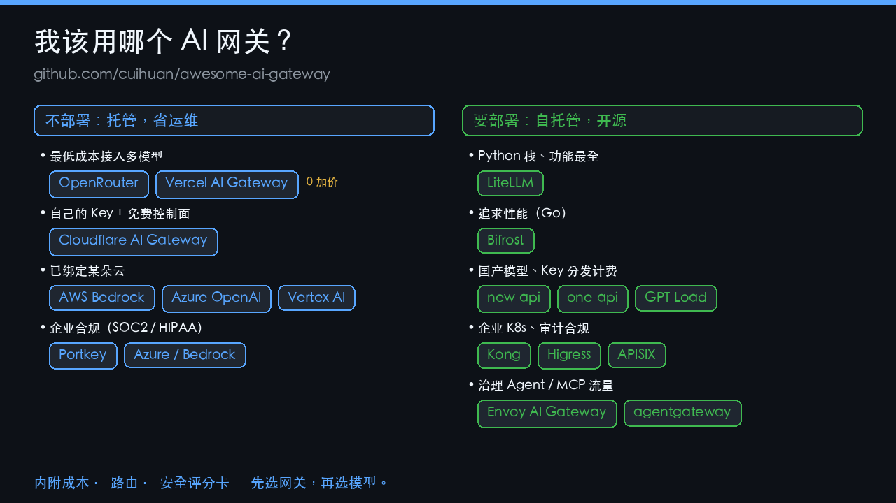
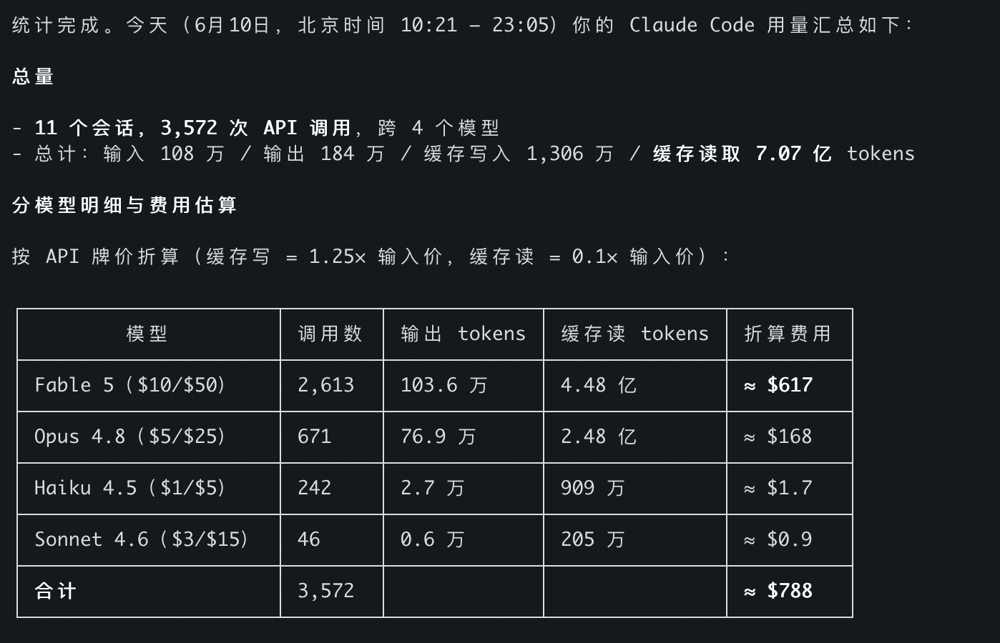

# Awesome AI Gateway [](https://awesome.re)

[](https://github.com/cuihuan/awesome-ai-gateway/stargazers)
[](BENCHMARKS.zh-CN.md)
[](.github/workflows/daily-update.yml)

> **按你的诉求，约 10 秒选对 AI 网关——而且这个答案可信。** 一棵决策树、可复现的成本评测，外加我们排除灰产的独立证据。按真实诉求分类，而非按厂商罗列。

_这清单是被账单逼出来的：**我一天在 AI 写代码上烧了 $788**——一个旗舰模型就吃掉 78%，只因为我把所有请求都默认打给了最贵的那个。于是我把整个网关生态摸了一遍。→ [完整故事](#为什么做这个)_

**语言：** [English](README.md) · 简体中文

<p align="center">
<a href="#我该用哪个网关"><kbd> &nbsp; 🧭 选网关 &nbsp; </kbd></a> &nbsp;
<a href="https://cuihuan.github.io/awesome-ai-gateway/"><kbd> &nbsp; 🚀 在线交互页 &nbsp; </kbd></a> &nbsp;
<a href="BENCHMARKS.zh-CN.md"><kbd> &nbsp; 📊 成本与评分卡 &nbsp; </kbd></a>
</p>

<details>
<summary>📑 <b>完整目录</b> —— 快速选 · 按需浏览 · 参考</summary>

[](CONTRIBUTING.md)
[](LICENSE)
[](https://github.com/cuihuan/awesome-ai-gateway/commits/main)

**快速选** · [我该用哪个网关？](#我该用哪个网关) · [快速对比](#快速对比)

**按需浏览** · [💰 性价比优先](#-性价比优先) · [🔓 自托管开源](#-自托管开源) · [🏢 企业合规](#-企业合规) · [☁️ 原厂直连](#️-原厂直连云厂商模型厂商) · [🇨🇳 国内生态](#-国内生态) · [🤖 MCP 与 Agent 网关](#-mcp-与-agent-网关)

**参考** · [📊 评测集](BENCHMARKS.zh-CN.md) · [如何安全选型](#如何安全选型) · [常见问题 FAQ](#常见问题-faq) · [📚 必读精选](#-必读精选) · [📰 行业动态](#-行业动态) · [术语表](#术语表) · [为什么做这个](#为什么做这个) · [参与贡献](#参与贡献)

</details>

## 我该用哪个网关？

<p align="center">
  
</p>

**⚡ 快速答案** —— 每个需求一个稳妥默认项（备选见各分区链接）：

| 我要… | 首选 | 细读 |
|---|---|---|
| 最低成本接入多模型、零运维 | **OpenRouter** | [性价比优先](#-性价比优先) |
| 用自己的 Key、0 加价 | **Vercel** / **Cloudflare** | [性价比优先](#-性价比优先) |
| 自托管、功能最全 | **LiteLLM** | [自托管开源](#-自托管开源) |
| 自托管、开销最低 | **Bifrost**（Go） | [自托管开源](#-自托管开源) |
| 国产模型 + 团队 Key 计费 | **new-api** | [国内生态](#-国内生态) |
| 企业 K8s + 审计 | **Kong** / **Higress** | [企业合规](#-企业合规) |
| 最强合规（HIPAA/FedRAMP） | **Azure** / **Bedrock** | [原厂直连](#️-原厂直连云厂商模型厂商) |
| 治理 Agent / MCP 流量 | **agentgateway** | [MCP 与 Agent](#-mcp-与-agent-网关) |

<details>
<summary>📋 完整决策树 —— 每条分支、可复制</summary>

```text
要不要自己部署？
│
├─ 不部署 — 托管服务，省运维
│   ├─ 最低成本接入多模型 ──────────▶ OpenRouter · Vercel AI Gateway（0 加价）
│   ├─ 用自己的 Key + 免费控制面 ───▶ Cloudflare AI Gateway
│   ├─ 在意欧盟数据合规 ────────────▶ Requesty · Eden AI · nexos.ai
│   └─ 已绑定某朵云 ────────────────▶ AWS Bedrock · Azure APIM · Vertex AI
│
└─ 要部署 — 自托管 / 开源
    ├─ Python 技术栈、功能最全 ─────▶ LiteLLM
    ├─ 追求极致性能（Go/Rust/TS）──▶ Bifrost · Portkey Gateway
    ├─ 自带评测 + 可观测 ───────────▶ Helicone · Portkey Gateway
    ├─ 国产模型、Key 分发/计费 ─────▶ new-api · one-api · GPT-Load
    ├─ 企业 K8s、审计、护栏 ────────▶ Kong · Higress · APISIX · Envoy AI Gateway
    └─ 治理 Agent / MCP 流量 ───────▶ agentgateway · Lunar.dev
```

</details>

### ✅ 为什么可信
- **独立——不收厂商钱、无返利链接、CC0。** 不像那些靠返利的中转"榜单"，这里没人花钱就能上榜。
- **可复现，而非口说。** 每个成本数字都由[带单测的脚本](scripts/cost_calc.py)从[公开定价数据](data/models.json)算出；星数由 CI 每日刷新。
- **对风险诚实。** 我们披露 CVE、标注已归档/停更项目、并[排除灰产中转](#如何安全选型)——且有研究佐证。

---

> **为什么重要：** 同一个任务，取决于网关背后用哪个模型，成本能差 **100 倍**。**AI 网关**位于你的代码与大模型厂商之间——一个端点、一把 Key、打通所有模型——负责路由、故障转移、缓存、限流、成本核算与护栏，你只需改一个 `base_url`，而非为每家厂商重写应用。先在这里选对网关，[评测集](BENCHMARKS.zh-CN.md)再告诉你该路由到哪个模型。

<p align="center">
  <a href="BENCHMARKS.zh-CN.md"></a>
</p>

⭐ **觉得有用就点个 [Star](https://github.com/cuihuan/awesome-ai-gateway)** —— 下一个在选网关的工程师就是这样找到它的。CC0 授权，无需注册、无追踪、不收厂商一分钱。

## 快速对比

星数每日自动刷新。✅ 内置 · ➕ 插件/付费版 · ❌ 不支持。

| 项目 | 类型 | 星数 | 协议 | 多厂商 | 故障转移/负载均衡 | 缓存 | 护栏 | 成本核算 |
|---|---|---|---|---|---|---|---|---|
| [LiteLLM](https://github.com/BerriAI/litellm) | 开源代理 + SDK | <!--s:BerriAI/litellm-->⭐ 51k<!--/s--> | MIT¹ | ✅ 100+ | ✅ | ✅ | ✅ | ✅ |
| [new-api](https://github.com/QuantumNous/new-api) | 开源中转/计费 | <!--s:QuantumNous/new-api-->⭐ 39.5k<!--/s--> | AGPL-3.0 | ✅ | ✅ | ➕ | ➕ | ✅ |
| [one-api](https://github.com/songquanpeng/one-api) | 开源中转/计费 | <!--s:songquanpeng/one-api-->⭐ 35.1k<!--/s--> | MIT | ✅ | ✅ | ❌ | ❌ | ✅ |
| [Kong AI Gateway](https://github.com/Kong/kong) | 开源 API 网关 | <!--s:Kong/kong-->⭐ 43.6k<!--/s--> | Apache-2.0 | ✅ | ✅ | ✅ 语义缓存 | ✅ | ✅ |
| [Apache APISIX](https://github.com/apache/apisix) | 开源 API 网关 | <!--s:apache/apisix-->⭐ 16.8k<!--/s--> | Apache-2.0 | ✅ | ✅ | ➕ | ➕ | ➕ |
| [Portkey Gateway](https://github.com/Portkey-AI/gateway) | 开源网关 + SaaS | <!--s:Portkey-AI/gateway-->⭐ 12.1k<!--/s--> | MIT | ✅ 1600+ | ✅ | ✅ | ✅ 50+ | ➕ SaaS |
| [TensorZero](https://github.com/tensorzero/tensorzero) | 开源 LLMOps · ⚠️ 已归档'26 | <!--s:tensorzero/tensorzero-->⭐ 11.7k<!--/s--> | Apache-2.0 | ✅ | ✅ | ✅ | ➕ | ✅ |
| [Higress](https://github.com/higress-group/higress) | 开源 AI 原生网关 | <!--s:higress-group/higress-->⭐ 8.7k<!--/s--> | Apache-2.0 | ✅ | ✅ | ✅ | ✅ | ✅ |
| [GPT-Load](https://github.com/tbphp/gpt-load) | 开源密钥池代理 | <!--s:tbphp/gpt-load-->⭐ 6.2k<!--/s--> | MIT | ✅ | ✅ 密钥轮询 | ❌ | ❌ | ➕ |
| [Bifrost](https://github.com/maximhq/bifrost) | 开源网关（Go） | <!--s:maximhq/bifrost-->⭐ 5.9k<!--/s--> | Apache-2.0 | ✅ | ✅ 自适应 | ✅ | ✅ | ✅ |
| [Helicone](https://github.com/Helicone/helicone) | 开源可观测 + 网关 | <!--s:Helicone/helicone-->⭐ 5.8k<!--/s--> | Apache-2.0 | ✅ | ✅ | ✅ | ➕ | ✅ |
| [Envoy AI Gateway](https://github.com/envoyproxy/ai-gateway) | 开源 K8s 网关 | <!--s:envoyproxy/ai-gateway-->⭐ 1.8k<!--/s--> | Apache-2.0 | ✅ | ✅ | ➕ | ➕ | ✅ |
| [OpenRouter](https://openrouter.ai) | SaaS 模型市场 | — | 商业 | ✅ 400+ | ✅ | ✅ | ➕ | ✅ |
| [Vercel AI Gateway](https://vercel.com/ai-gateway) | SaaS（0 加价） | — | 商业 | ✅ 数百 | ✅ | ❌ | ❌ | ✅ |
| [Cloudflare AI Gateway](https://developers.cloudflare.com/ai-gateway/) | SaaS 控制面 | — | 商业（免费档） | ✅ | ✅ 动态路由 | ✅ | ✅ | ✅ 预算 |

¹ LiteLLM 核心为 MIT，仓库内含单独授权的企业版目录。

> 📂 **浏览原始数据**（机器可读，CC0）：[模型与价格 JSON](data/models.json) · [成本表 CSV](data/cost_table.csv) · [网关评分卡 CSV](data/gateways_scorecard.csv)。每个成本数字都由[带单测的脚本](scripts/cost_calc.py)从这些数据重新生成。

<p align="center">
  
</p>

> _全景速览 —— 按你的需求浏览下面的分区。_

## 💰 性价比优先

*痛点："用最少的钱接入最多的模型，还不想搞运维。"*

- [OpenRouter](https://openrouter.ai) — 最大的模型市场：一个 OpenAI 兼容 API 背后 400+ 模型，按量付费、自动故障转移；充值约收 5.5% 手续费。2026 年 5 月完成 1.13 亿美元 B 轮，约 800 万用户。
- [Vercel AI Gateway](https://vercel.com/ai-gateway) — 数百模型按**厂商原价（0 加价）**计费，每月 $5 免费额度，可选零数据保留；与 AI SDK 天然搭配。
- [Cloudflare AI Gateway](https://developers.cloudflare.com/ai-gateway/) — 免费控制面套在你自己的厂商 Key 之上：缓存、动态路由、统一账单、美元计价的预算上限（2026 公测）。
- [Requesty](https://requesty.ai) — 面向欧盟的 OpenRouter 替代：400+ 模型、20ms 内故障转移、约 5% 加价。
- [Eden AI](https://www.edenai.co) — 统一 API 接入 500+ 模型及视觉/OCR/语音；欧盟公司，平台费约 5.5%。
- [Helicone AI Gateway（云版）](https://www.helicone.ai) — **0 加价**直通计费，可观测能力打包赠送。
- [GPT-Load](https://github.com/tbphp/gpt-load) <!--s:tbphp/gpt-load-->⭐ 6.2k<!--/s--> — Go 写的高性能多渠道密钥轮询代理，把每把 Key 的额度榨干。
- [Loop Gateway](https://github.com/Loop-XXI/loop-gateway) — OpenAI 兼容代理，每个请求以比特币 sats（而非美元）计费。经 OpenRouter 接入 311 个模型、加价 15%。无需账号/邮箱/银行卡；用闪电网络充值即得 bearer token。三种鉴权（预付 bearer、L402、Cashu）。Go 编写，可 docker-compose 自托管，线上服务 [api.loopxxi.com](https://api.loopxxi.com)。
- [AIMLAPI](https://aimlapi.com) — 一个 OpenAI/Anthropic 兼容端点打通 400+ 模型（对话/图像/视频/音频/向量）；预付费，OpenRouter 式聚合器。
- [Novita AI](https://novita.ai) — 统一 API 接入 200+ 开源模型（DeepSeek/Qwen/Llama…），自带负载均衡、弹性扩缩与故障转移；另有 GPU 云。
- [FlintAPI](https://flintapi.ai) — 面向国产开源模型的托管 OpenAI 兼容网关；自称用自研 “PPU” 芯片运行 Qwen2.5-72B，比 OpenRouter 低约 30%。较新且未经核实——投产前请先验证模型保真度（可用 [canary_check.py](scripts/canary_check.py)）。
- [FlowBar](https://flowbarai.com) — 托管 OpenAI 兼容中转，转售 50+ 模型（GPT、Claude、Gemini、DeepSeek、Qwen、GLM、Kimi），定价低于 OpenRouter，支持美元/人民币/加密支付。较新且未经核实——投产前请先验证模型保真度（可用 [canary_check.py](scripts/canary_check.py)）。
- [OpenPaths](https://openpaths.io) — 托管 OpenAI 兼容路由，跨 15+ 厂商覆盖对话、图像、视频、音乐、语音、向量、转写与搜索；源码与开发在 [Codex Infinity](https://codex-infinity.com/lee101/openpaths)。较新的 SaaS。
- [Glama Gateway](https://glama.ai/ai/gateway) — OpenAI 兼容网关，接入 100+ 模型，统一账单、缓存与日志（开源内核 [glama-ai/lightport](https://github.com/glama-ai/lightport)）。

> 💡 任何网关都能再省一笔：开**语义缓存**（Kong、Bifrost、Zuplo），设**消费上限**（Cloudflare、Zuplo、Pydantic/Logfire），简单请求路由到便宜模型（见[智能路由](#-智能路由与模型选择)）。

## 🔓 自托管开源

*痛点："Key 在我手里、跑在我机器上，不交按量过路费。"*

- [LiteLLM](https://github.com/BerriAI/litellm) <!--s:BerriAI/litellm-->⭐ 51k<!--/s--> — 默认之选：Python SDK + 代理服务，以 OpenAI 格式打通 100+ 厂商，带虚拟 Key、预算、负载均衡与护栏。
- [Portkey Gateway](https://github.com/Portkey-AI/gateway) <!--s:Portkey-AI/gateway-->⭐ 12.1k<!--/s--> — 高速 TypeScript 网关（1600+ 模型、50+ 护栏），同时是 Portkey 商业 LLMOps 平台的底座。
- [TensorZero](https://github.com/tensorzero/tensorzero) <!--s:tensorzero/tensorzero-->⭐ 11.7k<!--/s--> — ⚠️ **2026 年 6 月已归档**（公司关停；仓库只读，Apache-2.0 代码与社区分支尚存）。Rust 网关 + 可观测 + 评测 + 实验优化一体。
- [Bifrost](https://github.com/maximhq/bifrost) <!--s:maximhq/bifrost-->⭐ 5.9k<!--/s--> — Maxim AI 出品的 Go 网关，号称比 LiteLLM 快约 50 倍；自适应负载均衡、集群模式、支持 MCP。
- [Helicone](https://github.com/Helicone/helicone) <!--s:Helicone/helicone-->⭐ 5.8k<!--/s--> — 可观测优先的平台（YC W23），配套 Rust [ai-gateway](https://github.com/Helicone/ai-gateway) <!--s:Helicone/ai-gateway-->⭐ 603<!--/s-->。
- [Plano](https://github.com/katanemo/plano) <!--s:katanemo/plano-->⭐ 6.6k<!--/s--> — 面向 Agent 的 AI 原生代理/数据面（原名 Arch Gateway / archgw）。
- [LLM Gateway](https://github.com/theopenco/llmgateway) <!--s:theopenco/llmgateway-->⭐ 1.3k<!--/s--> — 开源版 OpenRouter：跨厂商路由、管理与分析。
- [APIPark](https://github.com/APIParkLab/APIPark) <!--s:APIParkLab/APIPark-->⭐ 1.8k<!--/s--> — 云原生 LLM API 管理与分发平台。
- [Pydantic AI Gateway](https://github.com/pydantic/pydantic-ai-gateway) <!--s:pydantic/pydantic-ai-gateway-->⭐ 190<!--/s--> — BYOK 网关，带成本上限与 OTel；⚠️ 仓库已归档，现已并入 Pydantic Logfire。
- [OptiLLM](https://github.com/algorithmicsuperintelligence/optillm) <!--s:algorithmicsuperintelligence/optillm-->⭐ 4.2k<!--/s--> — 优化型推理代理，用测试时计算技术提升准确率。
- [aisuite](https://github.com/andrewyng/aisuite) <!--s:andrewyng/aisuite-->⭐ 14.8k<!--/s--> — 吴恩达的统一多厂商客户端。是库而非代理服务，适合不想加网络一跳的场景。
- [Shepherd Model Gateway (SMG)](https://github.com/lightseekorg/smg) <!--s:lightseekorg/smg-->⭐ 347<!--/s--> — Rust 写的引擎无关网关：一个 OpenAI/Anthropic 兼容端点统管 vLLM/SGLang/TRT-LLM 与云厂商，带 KV 缓存感知路由与 WASM 插件。
- [RelayPlane](https://github.com/RelayPlane/proxy) <!--s:RelayPlane/proxy-->⭐ 184<!--/s--> — MIT、本地优先的代理（npm）：11 家厂商一个端点，逐请求成本归因 + 硬性日/时预算上限。
- [SentryNode Gateway](https://github.com/nehadangwal/sentrynode-gateway) <!--s:nehadangwal/sentrynode-gateway-->⭐ 0<!--/s--> — 开放内核（Apache-2.0）的 AI 代理，主打成本治理 / FinOps 路由：自适应路由、预算上限与审计日志。早期项目，公开仓库目前为演示脚手架。
- ⚠️ 已停滞但有历史意义：[BricksLLM](https://github.com/bricks-cloud/BricksLLM) <!--s:bricks-cloud/BricksLLM-->⭐ 1.2k<!--/s-->（PII 脱敏、按 Key 限额；2025 年初起不再活跃）、[Glide](https://github.com/EinStack/glide) <!--s:EinStack/glide-->⭐ 161<!--/s-->（2024 年起停更）。

## 🏢 企业合规

*痛点："审计日志、PII 脱敏、RBAC、私有化部署，外加 2026 年 8 月生效的欧盟 AI 法案。"*

- [Kong AI Gateway](https://github.com/Kong/kong) <!--s:Kong/kong-->⭐ 43.6k<!--/s--> — 成熟 API 网关 + AI 插件：语义缓存/路由、Prompt 防护、token 限流；Konnect 提供托管控制面。
- [Apache APISIX](https://github.com/apache/apisix) <!--s:apache/apisix-->⭐ 16.8k<!--/s--> — 云原生 API + AI 网关，`ai-proxy` / `ai-proxy-multi` 插件。
- [Envoy AI Gateway](https://github.com/envoyproxy/ai-gateway) <!--s:envoyproxy/ai-gateway-->⭐ 1.8k<!--/s--> — 基于 Envoy Gateway 的 CNCF 系 GenAI 接入层，Tetrate 与彭博背书。
- [kgateway](https://github.com/kgateway-dev/kgateway) <!--s:kgateway-dev/kgateway-->⭐ 5.6k<!--/s--> — CNCF API/AI 网关，Solo.io 商业版 [Gloo AI Gateway](https://www.solo.io) 的底座。
- [TrueFoundry AI Gateway](https://www.truefoundry.com) — 企业网关：路由、护栏、RBAC，可部署进你的 K8s/VPC。
- [nexos.ai](https://nexos.ai) — Nord Security 创始团队的企业 AI 网关/编排（2025 年 10 月 €3000 万 A 轮）。
- [Tyk AI Studio](https://tyk.io) — AI 治理套件：预算、模型目录、护栏。
- [Gravitee Agent Mesh](https://www.gravitee.io) — APIM 内置 LLM Proxy、MCP Proxy 与 A2A。
- [WSO2 AI Gateway](https://wso2.com/api-manager/usecases/ai-gateway/) — LLM 出口流量管理：模型路由、语义缓存、护栏。
- [F5 AI Gateway](https://www.f5.com) — 容器化 AI 流量网关；通过收购 LeakSignal 增加数据泄露检测（2025-11）。
- [IBM API Connect AI Gateway](https://www.ibm.com) — LLM 流量的策略执行、脱敏与审计。
- [MuleSoft AI / Omni Gateway](https://www.mulesoft.com/platform/ai-gateway) — 把 LLM、MCP、Agent 流量与传统 API 一起治理。
- [Lunar.dev](https://github.com/TheLunarCompany/lunar) <!--s:TheLunarCompany/lunar-->⭐ 458<!--/s--> — 出口消费网关，已转向 MCP/Agent 治理。
- [KrakenD AI Gateway](https://www.krakend.io/docs/ai-gateway/) — 高性能、无状态的 Go API 网关（[krakend/krakend-ce](https://github.com/krakend/krakend-ce) <!--s:krakend/krakend-ce-->⭐ 2.6k<!--/s-->），带 AI 代理 + Prompt 安全层。
- [Broadcom Layer7 AI Gateway](https://www.broadcom.com/products/software/api-management) — 在成熟的 Layer7 API 平台上做 LLM 流量治理、威胁防护与配额。
- [Cequence AI Gateway](https://www.cequence.ai) — 以 API 安全为先的 AI 网关：发现、护栏、LLM/Agent 流量威胁防护。

## ☁️ 原厂直连（云厂商/模型厂商）

*痛点："已经绑定某朵云，要官方原生方案。"*

- [AWS Bedrock](https://aws.amazon.com/bedrock/) — 统一 Converse API 多模型接入、跨区域推理、AgentCore Gateway 管工具/MCP。
- [Azure API Management — GenAI gateway](https://learn.microsoft.com/azure/api-management/genai-gateway-capabilities) — 在 Azure OpenAI / AI Foundry 前做 token 限额、语义缓存与负载均衡。
- [Google Apigee + Vertex AI](https://cloud.google.com/apigee) — Apigee 的 LLM 网关模式 + Vertex Model Garden 托管模型库。
- [Cloudflare AI Gateway](https://developers.cloudflare.com/ai-gateway/) — 见[性价比优先](#-性价比优先)；最强的免费原厂选项。
- [Vercel AI Gateway](https://vercel.com/ai-gateway) — 已 GA，0 加价，可选零数据保留；Next.js / AI SDK 团队的默认选择。
- [Databricks Unity AI Gateway](https://www.databricks.com) — Mosaic AI Gateway 并入 Unity Catalog，增加 Agent + MCP 治理。

## 🇨🇳 国内生态

*痛点："国产模型（通义/DeepSeek/GLM/Kimi）、人民币支付、团队 Key 分发与计费。"*

- [new-api](https://github.com/QuantumNous/new-api) <!--s:QuantumNous/new-api-->⭐ 39.5k<!--/s--> — 最活跃的 one-api 分支，已是"统一 AI 模型枢纽"：协议转换、计费、Rerank/Realtime 端点。AGPL-3.0。
- [one-api](https://github.com/songquanpeng/one-api) <!--s:songquanpeng/one-api-->⭐ 35.1k<!--/s--> — 元祖级 LLM API 管理&分发系统（OpenAI/Azure/Claude/Gemini/DeepSeek/豆包…）；开发节奏已放缓。
- [Higress](https://github.com/higress-group/higress) <!--s:higress-group/higress-->⭐ 8.7k<!--/s--> — 阿里开源、基于 Envoy/Istio 的 AI 原生网关，通义/DeepSeek 一等公民；云版 higress.ai。
- [GPT-Load](https://github.com/tbphp/gpt-load) <!--s:tbphp/gpt-load-->⭐ 6.2k<!--/s--> — 智能密钥轮询的多渠道代理（Go）。
- [one-hub](https://github.com/MartialBE/one-hub) <!--s:MartialBE/one-hub-->⭐ 2.8k<!--/s--> — one-api 分支：更好的非 OpenAI 函数调用与统计页面。
- [simple-one-api](https://github.com/fruitbars/simple-one-api) <!--s:fruitbars/simple-one-api-->⭐ 2.3k<!--/s--> — 单二进制，把千帆/星火/混元/MiniMax/DeepSeek 适配为 OpenAI 接口。
- [Veloera](https://github.com/Veloera/Veloera) <!--s:Veloera/Veloera-->⭐ 1.6k<!--/s--> — one-api/new-api 系新晋中转平台。
- [uni-api](https://github.com/yym68686/uni-api) <!--s:yym68686/uni-api-->⭐ 1.2k<!--/s--> — 轻量级单配置文件统一 API 管理，无前端。
- [APIPark](https://github.com/APIParkLab/APIPark) <!--s:APIParkLab/APIPark-->⭐ 1.8k<!--/s--> — 国产云原生 AI & API 网关，带开放开发者门户。
- [VoAPI](https://github.com/VoAPI/VoAPI) <!--s:VoAPI/VoAPI-->⭐ 1.1k<!--/s--> — new-api 系的精致中转/计费面板（Go），偏重 UI 与运营。
- [done-hub](https://github.com/deanxv/done-hub) <!--s:deanxv/done-hub-->⭐ 773<!--/s--> — one-api/new-api 分支，计费与渠道管理更丰富。
- [Volcengine AI Gateway](https://www.volcengine.com/docs/6569/1356167) — 火山引擎（字节）云 AI 网关：豆包 + 第三方模型的统一接入、路由与治理。

> ⚠️ 本清单刻意**不收录逆向 / 转售的"free-api"类中转**——而且不只是出于原则。2026 年两篇测量研究发现中转群体存在系统性欺诈：[*Real Money, Fake Models*](https://arxiv.org/abs/2603.01919) 测得 **45.8%** 的指纹测试出现模型身份不符、输出偏离最高达 **47%**；[*Your Agent Is Mine*](https://arxiv.org/abs/2604.08407) 抓到中转**注入恶意代码**并**窃取预埋的 API key**。若你不得不甄别某一家，用[如何安全选型](#如何安全选型)里的 canary 对比测试。

## 🤖 MCP 与 Agent 网关

*痛点："Agent 开始调工具了——像治理 API 一样治理 MCP 流量。"* 2025–2026 最新品类。

- [agentgateway](https://github.com/agentgateway/agentgateway) <!--s:agentgateway/agentgateway-->⭐ 3.4k<!--/s--> — CNCF Agent 流量代理：MCP 治理与 Agent 间（A2A）通信。
- [Lunar.dev MCPX](https://github.com/TheLunarCompany/lunar) <!--s:TheLunarCompany/lunar-->⭐ 458<!--/s--> — 管理 MCP server 消费的网关。
- [Tetrate Agent Router Service](https://tetrate.io/products/tetrate-agent-router-service) — 托管 Envoy AI Gateway 集群：LLM + MCP 网关与护栏（约 5% 费率）。
- [Zuplo AI Gateway](https://zuplo.com/ai-gateway) — 可编程策略：美元消费上限、Prompt 注入检测、密钥脱敏、MCP 支持。
- [NetFoundry MCP/LLM Gateways](https://netfoundry.io) — 零信任 AI 网关（2026 年 6 月发布）。
- [AWS AgentCore Gateway](https://aws.amazon.com/bedrock/) — Bedrock AgentCore 内的工具/MCP 网关。
- [IBM ContextForge](https://github.com/IBM/mcp-context-forge) <!--s:IBM/mcp-context-forge-->⭐ 3.9k<!--/s--> — MCP 网关/注册中心，把多个 MCP server 聚合到一个端点，带鉴权、限流与可观测。
- [MetaMCP](https://github.com/metatool-ai/metamcp) <!--s:metatool-ai/metamcp-->⭐ 2.4k<!--/s--> — 把多个 MCP server 聚合成一个端点，带中间件（鉴权、过滤）与管理界面。
- [MCPJungle](https://github.com/mcpjungle/MCPJungle) <!--s:mcpjungle/MCPJungle-->⭐ 1.1k<!--/s--> — 自托管 MCP 注册中心 + 网关，面向企业的工具集中治理。
- [Obot](https://github.com/obot-platform/obot) <!--s:obot-platform/obot-->⭐ 840<!--/s--> — 开源 Agent 平台，自带 MCP 网关管控工具访问。
- [Director](https://github.com/fdmtl/director) <!--s:fdmtl/director-->⭐ 479<!--/s--> — 中间件：在一个连接后运行、加固并观测 MCP server。
- [Lasso MCP Gateway](https://github.com/lasso-security/mcp-gateway) <!--s:lasso-security/mcp-gateway-->⭐ 376<!--/s--> — 安全优先的 MCP 网关：插件式护栏、密钥脱敏、威胁检测。
- [Pomerium](https://github.com/pomerium/pomerium) <!--s:pomerium/pomerium-->⭐ 4.9k<!--/s--> — 身份感知访问代理，新增 MCP 支持：在 MCP server 前做基于策略的鉴权。

## 🔧 更多按能力分（横切关注点）

*这些横跨上面按需求分的分区——路由智能、可观测、Kubernetes 基础设施，与你选的网关互补。*

### 🧠 智能路由与模型选择

*痛点："每条 prompt 都路由到能胜任的最便宜模型。"*

- [Not Diamond](https://www.notdiamond.ai) — SOTA 模型路由智能，OpenRouter Auto 的幕后引擎。
- [Martian](https://withmartian.com) — 模型路由商业先驱，与埃森哲合作。
- [Inworld Router](https://inworld.ai/router) — 一个 API 打通 200+ 模型，按查询复杂度实时路由，**0 加价**（直通定价）；另提供开源模型的一方实时推理。研究预览中。
- [RouteLLM](https://github.com/lm-sys/RouteLLM) <!--s:lm-sys/RouteLLM-->⭐ 5k<!--/s--> — LMSYS 开源路由框架（研究级；2024 年后停更，但仍是经典论文+代码）。
- [OpenRouter Auto](https://openrouter.ai) — 一个模型 ID（`openrouter/auto`）按 prompt 自动路由。
- [Unify](https://unify.ai) — 早期神经网络 LLM 路由（公司已转向 Agent 方向）。
- [Bifrost 自适应负载均衡](https://github.com/maximhq/bifrost) / [Cloudflare 动态路由](https://developers.cloudflare.com/ai-gateway/) — 网关内置的路由能力。
- [Claude Code Router](https://github.com/musistudio/claude-code-router) <!--s:musistudio/claude-code-router-->⭐ 35.2k<!--/s--> — 让 Claude Code（及其它 Agent CLI）按请求类型路由到任意模型/厂商——DeepSeek、Qwen、本地模型。
- [vLLM Semantic Router](https://github.com/vllm-project/semantic-router) <!--s:vllm-project/semantic-router-->⭐ 4.5k<!--/s--> — 按意图/复杂度为每条 prompt 选模型的"模型混合"路由器；vLLM 项目。
- [NVIDIA LLM Router](https://github.com/NVIDIA-AI-Blueprints/llm-router) <!--s:NVIDIA-AI-Blueprints/llm-router-->⭐ 297<!--/s--> — 基于 NIM 的蓝图，按任务与复杂度把每条 prompt 路由到最合适的模型。
- [LLMRouter](https://github.com/ulab-uiuc/LLMRouter) <!--s:ulab-uiuc/LLMRouter-->⭐ 2k<!--/s--> — 图/学习式成本-质量模型路由的研究框架。
- [Orq.ai](https://orq.ai) — 托管路由控制面：30+ 厂商 500+ 模型，带重试、兜底、缓存与治理（BYOK）。

### 📊 可观测与成本核算

*痛点："谁在哪个模型上花了多少钱？质量为什么降了？"*

- [Helicone](https://github.com/Helicone/helicone) <!--s:Helicone/helicone-->⭐ 5.8k<!--/s--> — 日志、成本、会话、Prompt 实验；一行代码接入。
- [TensorZero](https://github.com/tensorzero/tensorzero) <!--s:tensorzero/tensorzero-->⭐ 11.7k<!--/s--> — ⚠️ **2026 年 6 月已归档**（仓库只读，Apache-2.0 代码与社区分支尚存）。网关+可观测+评测一体（Rust），数据留在你自己的 ClickHouse。
- [Portkey](https://portkey.ai) — 基于其开源网关的完整 LLMOps：链路追踪、预算、Prompt 管理。
- [vLLora（原 LangDB）](https://github.com/vllora/vllora) <!--s:vllora/vllora-->⭐ 804<!--/s--> — LangDB 团队的 Agent 调试与可观测工具。
- [Braintrust Proxy](https://github.com/braintrustdata/braintrust-proxy) <!--s:braintrustdata/braintrust-proxy-->⭐ 399<!--/s--> — 带缓存的代理，与 Braintrust 评测打通。
- [MLflow AI Gateway](https://github.com/mlflow/mlflow) <!--s:mlflow/mlflow-->⭐ 26.6k<!--/s--> — MLflow 平台内的统一端点与治理组件。
- [Respan](https://www.respan.ai/ai-gateway)（原 Keywords AI）— 一个端点接入 250+ 模型，带路由/兜底/缓存，外加内置可观测与 evals。

### ☸️ Kubernetes 原生与推理基础设施

*痛点："集群内路由到自托管模型（vLLM/Ollama），还要懂 GPU。"*

- [Gateway API Inference Extension](https://github.com/kubernetes-sigs/gateway-api-inference-extension) <!--s:kubernetes-sigs/gateway-api-inference-extension-->⭐ 695<!--/s--> — Kubernetes 推理感知路由标准。
- [AIBrix](https://github.com/vllm-project/aibrix) <!--s:vllm-project/aibrix-->⭐ 4.9k<!--/s--> — vLLM on K8s 的低成本控制面（字节跳动发起）。
- [llm-d](https://github.com/llm-d/llm-d) <!--s:llm-d/llm-d-->⭐ 3.4k<!--/s--> — K8s 原生分布式推理服务（红帽/谷歌/IBM 背书）。
- [Higress](https://github.com/higress-group/higress) <!--s:higress-group/higress-->⭐ 8.7k<!--/s--> / [Kong](https://github.com/Kong/kong) <!--s:Kong/kong-->⭐ 43.6k<!--/s--> / [Envoy AI Gateway](https://github.com/envoyproxy/ai-gateway) <!--s:envoyproxy/ai-gateway-->⭐ 1.8k<!--/s--> — 均已实现 inference-extension 式路由。
- [Traefik Hub AI Gateway](https://traefik.io) — Traefik 商业运行时内的 LLM 路由/安全。
- [Inference Gateway](https://github.com/inference-gateway/inference-gateway) <!--s:inference-gateway/inference-gateway-->⭐ 126<!--/s--> — 统一云端 + 本地（Ollama）模型的小型云原生网关。
- [KServe](https://github.com/kserve/kserve) <!--s:kserve/kserve-->⭐ 5.6k<!--/s--> — K8s 上的标准模型推理平台；LLM 服务带推理网关 / OpenAI 兼容运行时。
- [GPUStack](https://github.com/gpustack/gpustack) <!--s:gpustack/gpustack-->⭐ 5.2k<!--/s--> — 管理 GPU 集群并把 LLM 服务收口到一个 OpenAI 兼容端点。
- [vLLM Production Stack](https://github.com/vllm-project/production-stack) <!--s:vllm-project/production-stack-->⭐ 2.4k<!--/s--> — 规模化部署 vLLM 的参考 K8s 栈，带 KV 缓存感知的路由层。

## 📰 行业动态

*人工每月更新。最近审阅：2026-06-15。*

- **2026-06** · **TensorZero 关停** —— 这家 VC 支持的开源 LLMOps 网关（730 万美元种子轮）于 6 月 12 日归档仓库；原厂云纷纷内置网关/可观测能力，挤压独立玩家。（[byteiota](https://byteiota.com/tensorzero-shuts-down-what-oss-llmops-cant-survive/)）
- **2026-03** · **Helicone 被 Mintlify 收购**（转入维护模式）；同月 **LiteLLM 遭 PyPI 供应链投毒** —— v1.82.7/1.82.8 经 CI 令牌被窃植入后门、约 3 小时内被隔离，提醒务必锁定网关版本。（[Mintlify](https://www.mintlify.com/blog/mintlify-acquires-helicone)、[Trend Micro](https://www.trendmicro.com/en/research/26/c/inside-litellm-supply-chain-compromise.html)）
- **2026-05** · **Palo Alto Networks 完成对 Portkey 的收购**（4/30 宣布、5/29 完成），将这个 AI 网关作为其 Prisma AIRS 安全平台的控制面——标志着网关正成为核心安全基础设施。（[Palo Alto Networks](https://www.paloaltonetworks.com/company/press/2026/palo-alto-networks-completes-acquisition-of-portkey-to-secure-ai-agents)）
- **2026-05** · OpenRouter 完成 CapitalG 领投的 **1.13 亿美元 B 轮**，估值 13 亿美元——约 800 万用户、月均 ~100 万亿 token。（[TechCrunch](https://techcrunch.com/2026/05/26/openrouter-more-than-doubles-valuation-to-1-3b-in-a-year/)）
- **2026-06** · NetFoundry 发布**零信任 MCP 与 LLM 网关**，思科投资部跟投其 A 轮。（[PR Newswire](https://www.prnewswire.com/news-releases/netfoundry-launches-enterprise-class-mcp-and-llm-gateways-bringing-zero-trust-to-ai-deployments-302789053.html)）
- **2026** · Cloudflare AI Gateway 上线**美元计价消费上限**（公测），叠加动态路由与统一账单。（[Cloudflare 博客](https://blog.cloudflare.com/ai-gateway-spend-limits/)）
- **2025-11** · Pydantic AI Gateway 开放公测，随后并入 **Logfire**；F5 通过收购 **LeakSignal** 为其 AI Gateway 增加数据泄露检测。（[Pydantic Logfire](https://pydantic.dev/logfire)、[F5](https://www.f5.com/company/news/press-releases/data-leakage-detection-prevention-secure-ai-workloads)）
- **趋势** · MCP 网关成为独立品类；消费上限成为标配；**欧盟 AI 法案（2026 年 8 月起强制执行）**推高合规需求；**new-api 星数反超 one-api**，成为国内最活跃的中转系统；同时**独立网关洗牌**正在发生——Portkey（→Palo Alto）、Helicone（→Mintlify）被收购，TensorZero 关停。

## 🚀 最新版本发布（自动更新）

<!-- RELEASES:START -->
- **2026-06-21** · [lightseekorg/smg v1.6.0](https://github.com/lightseekorg/smg/releases/tag/v1.6.0) — v1.6.0
- **2026-06-21** · [deanxv/done-hub v1.22.5](https://github.com/deanxv/done-hub/releases/tag/v1.22.5) — v1.22.5
- **2026-06-20** · [BerriAI/litellm v1.89.3](https://github.com/BerriAI/litellm/releases/tag/v1.89.3) — v1.89.3
- **2026-06-20** · [yym68686/uni-api v1.7.139](https://github.com/yym68686/uni-api/releases/tag/v1.7.139) — Release 1.7.139
- **2026-06-20** · [QuantumNous/new-api v1.0.0-rc.14](https://github.com/QuantumNous/new-api/releases/tag/v1.0.0-rc.14) — v1.0.0-rc.14
- **2026-06-18** · [obot-platform/obot v0.23.1](https://github.com/obot-platform/obot/releases/tag/v0.23.1) — v0.23.1
- **2026-06-18** · [kgateway-dev/kgateway v2.3.4](https://github.com/kgateway-dev/kgateway/releases/tag/v2.3.4) — v2.3.4
- **2026-06-18** · [theopenco/llmgateway v1.4.0](https://github.com/theopenco/llmgateway/releases/tag/v1.4.0) — v1.4.0
- **2026-06-18** · [agentgateway/agentgateway v1.3.0](https://github.com/agentgateway/agentgateway/releases/tag/v1.3.0) — v1.3.0
- **2026-06-18** · [gpustack/gpustack v2.2.0](https://github.com/gpustack/gpustack/releases/tag/v2.2.0) — v2.2.0
- **2026-06-18** · [vllm-project/aibrix v0.7.0](https://github.com/vllm-project/aibrix/releases/tag/v0.7.0) — v0.7.0
- **2026-06-17** · [maximhq/bifrost cli/v0.10.6](https://github.com/maximhq/bifrost/releases/tag/cli/v0.10.6) — Bifrost CLI v0.10.6
<!-- RELEASES:END -->

## 术语表

<details>
<summary>上面表格里用到的关键术语（点击展开）</summary>

- **AI 网关 / LLM 网关** — 应用与大模型厂商之间的代理；一个端点、一把 Key 打通多模型。
- **LLM 路由** — 决定*每个请求走哪个模型*的部分（便宜款 vs 旗舰款，按成本或质量）。
- **故障转移（Fallback）** — 首选模型/厂商失败或超时时，自动改用另一个重试。
- **负载均衡（LB）** — 把流量分散到多个 Key/厂商，规避限流和宕机。
- **语义缓存** — 当*新* prompt 与历史 prompt 语义相近（而非完全相同）时返回缓存答案。
- **Prompt / 缓存输入** — 厂商对复用的 prompt 前缀大幅打折（约 0.1×）；网关若改动前缀会导致缓存失效。
- **护栏（Guardrails）** — 输入/输出检查：Prompt 注入检测、PII 脱敏、内容过滤、结构化校验。
- **虚拟 Key** — 网关在你真实厂商 Key 前面发放的按用户/团队的 Key，各带预算与限额。
- **ZDR（零数据保留）** — 厂商/网关以合约形式承诺不存储你的 prompt 和回复。
- **BYOK** — 自带 Key：网关用*你自己*的厂商账号，而非转售 token。
- **Markup（加价）** — 网关在厂商 token 成本之上收的费（0% 到约 6%）。
- **MCP 网关** — 治理 Agent ↔ 工具流量（Model Context Protocol），是 LLM 网关在智能体侧的对应物。

</details>

## 如何安全选型

**先把网关的信任级别和你数据的敏感度对上**——这一刀基本决定了后面大部分：

| 你的数据 | 走这个 | 别 |
|---|---|---|
| 🔴 **机密 / 受监管**（PII、医疗、财务、源码、密钥） | 原厂**直连 + ZDR**（Azure / Bedrock / Vertex），或**自托管在你自己 VPC** 里的网关 | …走*任何*第三方中转——没得商量 |
| 🟡 **内部 / 业务** | 合规托管（Cloudflare、Vercel、Portkey）**或**自托管（LiteLLM、Bifrost） | …用没核验过的中转；要书面 ZDR |
| 🟢 **不重要 / 公开 / 一次性**（demo、公开抓取的文本） | 便宜的赢——这种场景下用灰产中转甚至*经济上合理* | …不做 [canary 验真](#如何安全选型) 就用：在你证明之前，默认它在换模型 + 收数据 |

> 错误是对所有流量用同一个信任档。敏感 prompt 走 $0.50/M 的中转，就是密钥泄露的方式；一次性 prompt 走 FedRAMP 端点，就是多付 100× 的方式。**按数据匹配档位。**

然后，不管你在哪一档：

1. **看加价。** 模型市场收 0–6% 不等——量大时，自托管或 0 加价网关（Vercel、Helicone 云版）很快回本。
2. **验模型真伪（canary 对比测试）。** 部分中转会偷偷降智或量化。把固定的"canary"prompt——一道已知高难推理题 + 一个 tokenizer/指纹探针——同时走网关*和*官方直连，再**对比（diff）输出**——[`scripts/canary_check.py`](scripts/canary_check.py) 帮你自动跑完并给判定（可附进[避雷举报](https://github.com/cuihuan/awesome-ai-gateway/issues/new?template=report-relay.yml)）。2026 年研究发现约 46% 的受测中转出现模型身份不符（[arXiv:2603.01919](https://arxiv.org/abs/2603.01919)）。社区监测站 [apiranking.com](https://apiranking.com) 与 [rate.linux.do](https://rate.linux.do)（需浏览器打开）追踪中转的真伪与稳定性——不得不甄别时可作*信号*，但**列在那里不等于背书，本清单一个都不收录。**
3. **盯数据流向。** 所有网关都看得到你的 prompt。敏感数据：自托管，或拿到书面零数据保留（ZDR）承诺。
4. **嵌入前查协议。** new-api 是 AGPL-3.0；LiteLLM 含企业授权目录；"open core" ≠ 全部免费。
5. **看项目健康度。** 星数 ≠ 维护。看最近 release 日期——几个曾经热门的网关（BricksLLM、Glide、RouteLLM）实际已停更，本清单都打了标。
6. **远离灰产中转**（逆向接口、盗刷额度转售）。除封号风险外，2026 年研究还抓到中转投放被投毒的模型、窃取预埋密钥（[*Your Agent Is Mine*](https://arxiv.org/abs/2604.08407)）——而且最显眼的中转"榜单"往往是付费稿或带返利链接。封号和数据泄露的风险在你，不在它。**抓到哪家在换模型、收数据、或卷款跑路？[带证据来举报](https://github.com/cuihuan/awesome-ai-gateway/issues/new?template=report-relay.yml)——我们一起把社区避雷板建起来。**

## 常见问题 FAQ

**什么是 AI 网关（LLM 网关）？**
位于你的代码与大模型厂商之间的代理：用一个 OpenAI 兼容端点和一把 Key 打通多个模型，附带路由、故障转移、缓存、限流、成本核算与护栏。见[开头介绍](#我该用哪个网关)。

**AI 网关和 LLM 路由有什么区别？**
*路由*决定每个请求*走哪个模型*（如便宜款 vs 旗舰款）；*网关*是完整的代理层（鉴权、缓存、可观测、护栏），通常*包含*路由。见[智能路由](#-智能路由与模型选择)。

**最好的开源 AI 网关是哪个？**
[LiteLLM](https://github.com/BerriAI/litellm) 功能最全（Python，100+ 厂商）；追求性能选 [Bifrost](https://github.com/maximhq/bifrost)（Go）；企业 K8s 选 [Kong](https://github.com/Kong/kong) 或 [Higress](https://github.com/higress-group/higress)。完整列表见[自托管开源](#-自托管开源)。

**LiteLLM 和 OpenRouter 怎么选？**
OpenRouter 是托管（零运维、约 5.5% 手续费、400+ 模型）；LiteLLM 是自托管（Key 在你手里、零加价）。先用托管，量大了再自托管。成本对比见[评测集](BENCHMARKS.zh-CN.md#第三部分--真实-token-成本实测脚本计算)。

**接入多个大模型最省钱的方式？**
零运维：[Vercel AI Gateway](https://vercel.com/ai-gateway) 或 [Cloudflare AI Gateway](https://developers.cloudflare.com/ai-gateway/)（0 加价）。论 token 成本，把批量任务路由到便宜模型——一份 10 万 token 报告 **DeepSeek 花 $0.03，GPT-5.5 花 $3.01**。见[性价比优先](#-性价比优先)。

**AI 网关安全吗？谁能看到我的 Prompt？**
所有网关都看得到你的 Prompt。敏感数据请自托管或要求书面零数据保留；合规/安全评分和已知 CVE 见[网关评分卡](BENCHMARKS.zh-CN.md#第四部分--网关四维评分合规价格安全稳定)。

## 📚 必读精选

*一张短而经过核验的书单——下列每个链接都在 2026-06-15 做过实时 HTTP 检查。这些是对比表默认你已掌握的概念，定网关前先读。*

**AI 网关到底是什么**
- [LLM Gateway: The One Decision That Removes 100 AI Engineering Decisions](https://www.latent.space/p/gateway) — Latent.Space（swyx），2025-02 — 为什么一个网关选择，就把路由、缓存、可观测与护栏收敛进同一个控制面。
- [AI Gateway — overview](https://developers.cloudflare.com/ai-gateway/) — Cloudflare — 一方文档定义这一范式：在众多供应商前架一个统一端点，叠加缓存、限流、分析与成本核算。
- [AI Gateway documentation](https://developer.konghq.com/index/ai-gateway/) — Kong — 网关的关注点（供应商无关路由、PII 脱敏、token 限流）如何映射到成熟的 API 网关基础设施。

**路由与故障转移**
- [Routing & load balancing](https://docs.litellm.ai/docs/routing-load-balancing) — LiteLLM — 部署最广的开源网关给出的跨供应商路由、加权负载均衡与分级故障转移。
- [Router architecture (fallbacks & retries)](https://docs.litellm.ai/docs/router_architecture) — LiteLLM — 组内重试与跨组故障转移在遇到 429/连接错误时如何逐级升级——评估可靠性的核心机制。
- [Load balancing](https://portkey.ai/docs/product/ai-gateway/load-balancing) — Portkey — 在供应商、模型与 key 间做加权、粘性分发，让任一供应商都不成为瓶颈。
- [FrugalGPT: Using LLMs While Reducing Cost and Improving Performance](https://arxiv.org/abs/2305.05176) — Chen、Zaharia、Zou（斯坦福），2023 — 成本感知路由的奠基论文：模型级联，先试便宜的、必要时才升级。

**语义缓存**
- [GPTCache documentation](https://gptcache.readthedocs.io/) — Zilliz — 事实标准的开源语义缓存：embedding + 向量相似度 vs 精确匹配。
- [GPTCache: An Open-Source Semantic Cache for LLM Applications](https://openreview.net/forum?id=ivwM8NwM4Z) — Fu Bang，EMNLP 2023 — 经同行评审，论证相似度匹配缓存如何提升命中率、降低成本与延迟。

**Prompt 缓存（本质是前缀匹配）**
- [Prompt caching](https://docs.anthropic.com/en/docs/build-with-claude/prompt-caching) — Anthropic — 权威规范：缓存键由断点前的精确字节派生、读写定价与 TTL。
- [Prompt caching](https://platform.openai.com/docs/guides/prompt-caching) — OpenAI — 缓存命中需前缀精确匹配；静态指令在前、可变内容在后以最大化复用。

**推理 token 成本**
- [Building with extended thinking](https://platform.claude.com/docs/en/docs/build-with-claude/extended-thinking) — Anthropic — 推理/思考 token 同样计费且占用输出预算——在网关后启用推理模型前要懂的经济学。

**安全与护栏**
- [OWASP Top 10 for LLM Applications](https://owasp.org/www-project-top-10-for-large-language-model-applications/) — OWASP，2025 — 业界标准风险分类，prompt injection 为 LLM01，任何网关护栏都要对照。
- [Design patterns for securing LLM agents against prompt injection](https://simonwillison.net/2025/Jun/13/prompt-injection-design-patterns/) — Simon Willison，2025-06 — 六种具体架构防御（Dual LLM、Plan-Then-Execute、Action-Selector…）。
- [LLM Prompt Injection Prevention Cheat Sheet](https://cheatsheetseries.owasp.org/cheatsheets/LLM_Prompt_Injection_Prevention_Cheat_Sheet.html) — OWASP — 网关护栏层该实现的纵深防御清单。

**MCP 与 Agent 网关**
- [Model Context Protocol — specification](https://modelcontextprotocol.io/specification/2025-03-26) — 任何 MCP 网关都必须理解并治理的开放标准。
- [Building effective agents](https://www.anthropic.com/engineering/building-effective-agents) — Anthropic，2024 — 何时用 workflow、何时用 agent，以及可组合的模式（路由、orchestrator-workers）——这正是 Agent 网关要治理的流量。
- [LLM Powered Autonomous Agents](https://lilianweng.github.io/posts/2023-06-23-agent/) — Lilian Weng，2023 — agent 架构（规划、记忆、工具调用）的经典全景——MCP/Agent 网关所守护的对象。

**可观测性**
- [AI Gateway observability](https://developers.cloudflare.com/ai-gateway/observability/) — Cloudflare — 逐请求日志、token 用量、成本估算与跨供应商的 OpenTelemetry 导出。
- [How to monitor your LLM API costs](https://www.helicone.ai/blog/monitor-and-optimize-llm-costs) — Helicone — 单次查询成本追踪，以及发现缓存/模型降级机会的实操。
- [Your AI Product Needs Evals](https://hamel.dev/blog/posts/evals/) — Hamel Husain，2024 — 为什么系统化的 evals（而非凭感觉）才是从网关记录的请求/响应数据里真正抓出质量回退的办法。

**自托管经济学**
- [Automatic prefix caching](https://docs.vllm.ai/en/stable/design/prefix_caching/) — vLLM — KV-block 前缀缓存（及逐请求缓存隔离），自托管时省钱的底层机制。

## 指南与对比

针对大家真实搜索的问题,做了数据支撑的深度对比:

- [**one-api vs new-api vs LiteLLM**](compare/one-api-vs-new-api-vs-litellm.zh-CN.md) — 国内大模型 API 中转/网关怎么选(2026)
- [**LiteLLM vs OpenRouter vs Portkey (2026)**](compare/litellm-vs-openrouter-vs-portkey-2026.md) — 该用哪个 AI 网关?(英文)
- [**LiteLLM alternatives (2026)**](compare/litellm-alternatives-2026.md) — LiteLLM 替代方案:8 个网关按成本/安全/自托管对比(英文)
- [**OpenRouter alternatives (2026)**](compare/openrouter-alternatives-2026.md) — OpenRouter 替代方案:0 加价/欧盟合规/自托管选项对比(英文)
- [**Cloudflare vs Vercel AI Gateway (2026)**](compare/cloudflare-vs-vercel-ai-gateway-2026.md) — 两个 0 加价托管网关怎么选(英文)
- [**Best self-hosted AI gateway 2026**](compare/best-self-hosted-ai-gateway-2026.md) — 自托管网关对比(英文)

*更多对比陆续更新。想看哪个对比?提个 [issue](https://github.com/cuihuan/awesome-ai-gateway/issues)。*

## 为什么做这个

**6 月 10 日，我重度用 Claude Code 写了约 13 小时代码，账单结算 ≈ $788。** 分模型一拆，问题一目了然：旗舰模型（Fable 5）一个就吃掉 **$617——占 78%**，而便宜的 Haiku 干了 242 次活只花了 **$1.70**。我没干什么"骚操作"把它刷这么高，恰恰相反——我把每个请求都默认丢给了最强（也最贵）的模型，纯粹因为懒得配路由。

<p align="center">
  
</p>

解法不是"别用好模型"，而是**按任务路由**——默认走便宜模型，真遇到难的再升级到旗舰。这正是 AI 网关该干的事。顺手我还发现：全网找不到一份"按你真实诉求分类、敢如实打分（含 CVE）、成本数还能复现"的网关清单。那就自己做一份——就是这个仓库。

不收厂商钱、无返利链接、CC0。如果它帮你挡下哪怕一次账单意外，就值了。⭐ **[点个 Star](https://github.com/cuihuan/awesome-ai-gateway)**，让下一个正在烧 $788 的人也能找到它。

## 参与贡献

欢迎贡献！请先阅读 [CONTRIBUTING.md](CONTRIBUTING.md)。收录标准简述：必须是真正的 LLM/Agent 流量网关、代理或路由（不是 SDK 封装或聊天 UI），公开可用，且最近 12 个月内活跃——或明确标注停滞状态。

## Star 历史

[](https://star-history.com/#cuihuan/awesome-ai-gateway&Date)

## 许可

[](https://creativecommons.org/publicdomain/zero/1.0/)

在法律允许的范围内，贡献者已放弃本作品的所有版权及相关权利。
